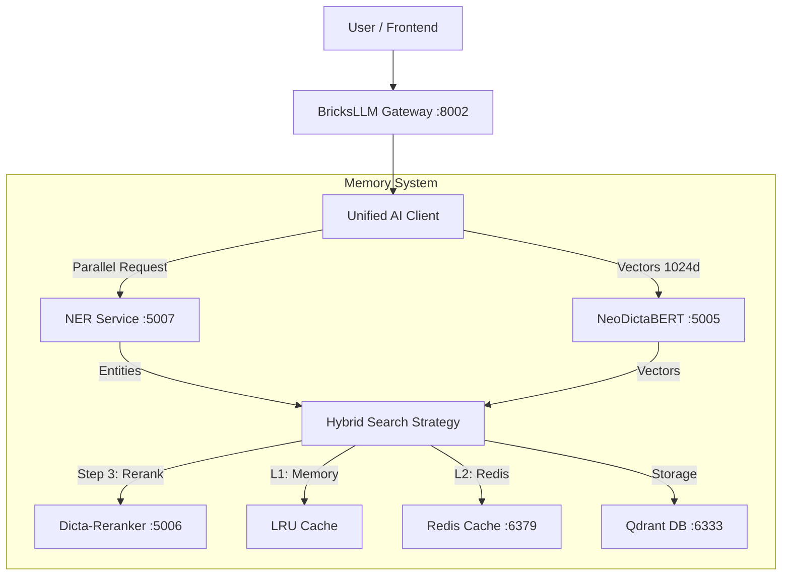

# DictaBERT-NER & NeoDictaBERT Integration Plan

**Status**: Planning
**Version**: 1.1 (Detailed Implementation)
**Owner**: Ilan
**Date**: 2025-01-26

## 1. Executive Summary

This plan details the integration of **DictaBERT-NER** (Entity Extraction) and **NeoDictaBERT-bilingual** (Semantic Embedding) into the BricksLLM memory architecture. The goal is to achieve **RoamPal parity** with an enterprise-grade, "same-way" implementation using Dockerized microservices, Qdrant vector storage, and 2-level caching.

**Key Features:**
*   **Dual-Model Pipeline**: Hybrid NER + Semantic search for optimal retrieval.
*   **Performance**: Parallel execution (`Promise.allSettled`) and 2-level caching (LRU + Redis).
*   **Hebrew Native**: Full support for Hebrew morphology and entities.
*   **Infrastructure**: Dockerized Python (NER) and TypeScript (Semantic) services.

## 2. Architecture Overview

### 2.1 Component Diagram



### 2.2 Data Flow
1.  **Input**: User sends text message.
2.  **Processing**: `UnifiedAIClient` dispatches parallel requests to NER and Semantic services.
3.  **Optimization**: Results are cached in LRU (memory) and Redis (distributed).
4.  **Storage**: Vectors (1024d) and Metadata (Entities) stored in Qdrant.
5.  **Retrieval**: Hybrid search uses entities for pre-filtering, vectors for initial ranking, and **Cross-Encoder Reranker** for final precision.

## 3. Core Components Implementation

### 3.1 Zod Schemas (Type Safety)

We enforce strict runtime validation for all external service responses, specifically ensuring the 1024-dimensional vector size.

```typescript
import { z } from 'zod';

// NER Entity Schema
export const NEREntitySchema = z.object({
  entity_group: z.string(), // e.g., 'PER', 'ORG', 'LOC'
  word: z.string(),
  score: z.number(),
  start: z.number(),
  end: z.number(),
});

export const NERResponseSchema = z.object({
  entities: z.array(NEREntitySchema),
  processing_time_ms: z.number().optional(),
});

// Semantic Embedding Schema
// STRICT 1024 dimension check for NeoDictaBERT-bilingual
export const EmbeddingResponseSchema = z.object({
  embedding: z.array(z.number()).length(1024), 
  usage: z.object({
    total_tokens: z.number(),
  }).optional(),
});

export type NEREntity = z.infer<typeof NEREntitySchema>;
export type NERResponse = z.infer<typeof NERResponseSchema>;
export type EmbeddingResponse = z.infer<typeof EmbeddingResponseSchema>;
```

```
// 1. Initialize unified client
const client = new UnifiedAIClient({
  nerServiceUrl: 'http://ner:5007',
  semanticServiceUrl: 'http://dicta-retrieval:5005',
});

// 2. Process text (Entities + Embedding)
const result = await client.processTextFull("דני אבדיה קלע 30 נקודות בוושינגטון", "trace-123");

/* Result:
{
  entities: ["דני אבדיה", "וושינגטון"],
  embedding: [0.012, -0.045, ...], // 1024d from Semantic Service
  metadata: { latency: 45 }
}
*/
```

### 3.2. UnifiedAIClient Implementation
*   **Goal**: Create a unified client for all AI operations (NER, Embeddings, Reranking, Semantic Density).
*   **Location**: `src/lib/server/memory/UnifiedAIClient.ts`
*   **Dependencies**: `CircuitBreaker` (Tier 5), `mcp-sse-proxy` (Tier 2).

```typescript
// src/lib/server/memory/UnifiedAIClient.ts
import { CircuitBreaker, CircuitState } from "../textGeneration/mcp/circuitBreaker";

export interface EnrichmentResult {
    entities: ExtractedEntity[];
    embedding: number[];
    semanticDensity: number; // New metric for memory quality
    metadata: {
        latency: number;
        degraded: boolean;
        model_version: string;
    };
}

export class UnifiedAIClient {
    private nerUrl: string;
    private embeddingUrl: string;
    private circuitBreaker: CircuitBreaker;

    constructor(config: UnifiedAIClientConfig) {
        this.nerUrl = config.nerUrl;
        this.embeddingUrl = config.embeddingUrl;
        // Initialize with standard policy: 5 failures, 30s reset, 60s monitoring
        this.circuitBreaker = new CircuitBreaker({
            failureThreshold: 5,
            resetTimeout: 30000,
            monitoringPeriod: 60000
        });
    }

    async processTextFull(text: string, traceId: string): Promise<EnrichmentResult> {
        // 1. Fast Fail: Check Circuit State
        if (this.circuitBreaker.getState() === CircuitState.OPEN) {
            console.warn(`[UnifiedAI] Circuit OPEN. Returning fallback for trace ${traceId}`);
            return this.getFallbackResult(text);
        }

        try {
            // 2. Execute with Timeout & Monitoring
            // Note: circuitBreaker.execute() handles state transitions automatically
            return await this.circuitBreaker.execute(async () => {
                const [ner, emb] = await Promise.allSettled([
                    this.fetchNER(text, traceId),
                    this.fetchEmbedding(text, traceId)
                ]);
                
                // Check for critical failures
                if (emb.status === 'rejected') {
                     throw new Error(`Critical Embedding Failure: ${emb.reason}`);
                }

                // Merge results
                const entities = ner.status === 'fulfilled' ? ner.value : [];
                const embedding = emb.status === 'fulfilled' ? emb.value : this.generateFallbackEmbedding(text);
                
                // Calculate Semantic Density (Entities per 100 words)
                const wordCount = text.split(/\s+/).length;
                const semanticDensity = wordCount > 0 ? (entities.length / wordCount) * 100 : 0;

                return {
                    entities,
                    embedding,
                    semanticDensity,
                    metadata: {
                        latency: 0, // Calculate actual latency
                        degraded: ner.status === 'rejected',
                        model_version: "dictalm-3.0"
                    }
                };
            }, "ai-enrichment");

        } catch (err) {
            // 3. Fallback on Failure
            console.error(`[UnifiedAI] Execution failed: ${err}`);
            return this.getFallbackResult(text);
        }
    }

    // ... (fetchNER, fetchEmbedding implementation) ...
    
    /**
     * Generate a semantic signature for Known Solution Lookup
     * Used to verify if a problem is semantically identical to a cached solution
     */
    async generateSemanticSignature(text: string): Promise<number[]> {
        // Use a lightweight embedding or hash of the embedding
        return this.fetchEmbedding(text, "sig-gen");
    }

    private getFallbackResult(text: string): EnrichmentResult {
        return {
            entities: [],
            embedding: this.generateFallbackEmbedding(text),
            semanticDensity: 0,
            metadata: { latency: 0, degraded: true, model_version: "fallback" }
        };
    }
}
```

### 3.3. Semantic Model Integration Points
*   **Semantic Density**: Used for initial memory quality scoring. High density = potentially higher value.
*   **Semantic Signature**: Used in `SearchService` to replace/augment the string-based problem hash for "Known Solution Lookup".

### 3.3 Hybrid Search Logic (Optimization Guide L368-418)

The hybrid search strategy combines entity precision with semantic breadth, using dynamic strategy selection.

```typescript
export type SearchStrategy = 'entity' | 'semantic' | 'hybrid';

export interface SearchOptions {
  strategy?: SearchStrategy;
  entityWeight?: number; // Default 0.4
  semanticWeight?: number; // Default 0.6
  topK?: number;
}

export class HybridSearchStrategy {
    constructor(
        private unifiedClient: UnifiedAIClient,
        private qdrantClient: QdrantClient,
        private reranker: RerankerClient // Port 5006
    ) {}

    async search(query: string, documents: Document[], options: SearchOptions = {}) {
        // 1. Analyze Query (Parallel NER + Embedding)
        const { entities, embedding } = await this.unifiedClient.processTextFull(query, 'search-trace');
        
        // 2. Determine Strategy (if not forced)
        const strategy = options.strategy || this.selectStrategy(entities);
        
        // 3. Execute Optimized Search
        let results;
        switch (strategy) {
            case 'entity':
                results = await this.entitySearch(entities, documents);
                break;
            case 'semantic':
                results = await this.semanticRank(embedding, documents);
                break;
            case 'hybrid':
                results = await this.hybridSearchInternal(entities, embedding, documents, options);
                break;
        }

        // 4. Reranking Step (Critical for Precision)
        // Re-score top 50 results using Cross-Encoder
        return this.reranker.rerank(query, results.slice(0, 50), options.topK || 10);
    }

    private selectStrategy(entities: NEREntity[]): SearchStrategy {
        // Heuristic: If entities found, use hybrid; otherwise semantic
        return entities.length > 0 ? 'hybrid' : 'semantic';
    }

    private async hybridSearchInternal(entities: NEREntity[], embedding: number[], documents: Document[], options: SearchOptions) {
        // Step 1: Entity Pre-filtering (Fast Reduce) - L434
        // If query has entities, only look at docs that match at least one
        let candidateDocs = documents;
        if (entities.length > 0) {
            const queryEntitySet = new Set(entities.map(e => e.word.toLowerCase()));
            candidateDocs = documents.filter(doc => 
                doc.metadata.entities.some((e: any) => queryEntitySet.has(e.word.toLowerCase()))
            );
            // Fallback: If filtering removes all docs, revert to full set
            if (candidateDocs.length === 0) candidateDocs = documents; 
        }

        // Step 2: Semantic Ranking (Deep Rank)
        return this.rankBySimilarity(embedding, candidateDocs);
    }
    
    private async rankBySimilarity(queryVec: number[], docs: Document[]) {
        return docs
            .map(doc => ({
                doc,
                score: this.cosineSimilarity(queryVec, doc.embedding)
            }))
            .sort((a, b) => b.score - a.score)
            .map(item => item.doc);
    }

    private cosineSimilarity(vecA: number[], vecB: number[]): number {
        const dot = vecA.reduce((sum, v, i) => sum + v * vecB[i], 0);
        // Assuming normalized vectors (magnitude = 1), dot product is cosine similarity
        return dot;
    }

    // ... entitySearch implementation
}
```

### 3.4 Two-Level Caching (LRU + Redis)

We implement a transparent caching bridge that checks local memory first, then Redis, before calling external services.

```typescript
export class LruRedisBridge {
  private lru: LRUCache<string, number[]>;
  private redis: RedisClient;

  constructor() {
    this.lru = new LRUCache({ max: 1000 }); // Fast, process-local
    // Redis connection setup...
  }

  async getEmbedding(text: string): Promise<number[] | null> {
    const key = `emb:${hash(text)}`;

    // Level 1: Memory (Microsecond latency)
    if (this.lru.has(key)) return this.lru.get(key)!;

    // Level 2: Redis (Millisecond latency)
    const cached = await this.redis.get(key);
    if (cached) {
      const embedding = JSON.parse(cached);
      this.lru.set(key, embedding); // Backfill L1 for next time
      return embedding;
    }

    return null; // Cache Miss
  }

  async setEmbedding(text: string, embedding: number[]) {
    const key = `emb:${hash(text)}`;
    this.lru.set(key, embedding);
    await this.redis.set(key, JSON.stringify(embedding), 'EX', 86400); // 24h TTL
  }
}
```

## 4. Infrastructure & Deployment

### 4.1 Docker Compose Configuration (Service Split Strategy)

To maintain backward compatibility with `http://dicta-retrieval:5005` while introducing NeoDictaBERT and preserving the Reranker, we split the services:

1.  **`dicta-retrieval` (New)**: Runs NeoDictaBERT. Takes over port 5005.
2.  **`dicta-reranker` (Renamed Old)**: Runs BAAI Reranker. Takes port 5006.
3.  **`ner-service` (New)**: Runs Hebrew NER. Takes port 5007.

```yaml
services:
  # 1. NEW: NeoDictaBERT (Hijacks the 'dicta-retrieval' name)
  dicta-retrieval:
    image: dictalm/neodictabert-serving:latest
    container_name: dicta-retrieval
    ports:
      - "5005:5005" # Maps Host 5005 -> NeoDictaBERT
    environment:
      - MODEL_ID=dicta-il/neodictabert-bilingual
      - PORT=5005
    networks:
      - bricksllm-network

  # 2. RENAMED: Old Service (Reranker Only)
  dicta-reranker:
    build:
      context: .
      dockerfile: Dockerfile.BAAI
    container_name: dicta-reranker
    ports:
      - "5006:5006" # Reranker stays on 5006
    environment:
      # Disable embedding to save resources, if possible, or just ignore 5005
      - RERANKING_PORT=5006
      - EMBEDDINGS_MODEL_N_GPU_LAYERS=0 # Disable/Offload embedding
    networks:
      - bricksllm-network

  # 3. NEW: Hebrew NER
  ner-service:
    image: dictalm/hebrew-ner:latest
    container_name: ner-service
    ports:
      - "5007:5007"
    environment:
      - PORT=5007
    networks:
      - bricksllm-network
```

**Required Config Changes (`.env`):**
- `EMBEDDING_SERVICE_URL=http://dicta-retrieval:5005` (Unchanged! Points to NeoDictaBERT now)
- `RERANKER_SERVICE_URL=http://dicta-reranker:5006` (Updated to new service name)

### 4.2 Qdrant Collection Configuration
The vector collection is optimized for 1024-dimension vectors and fast filtering.

```json
PUT /collections/bricks_memory
{
  "vectors": {
    "size": 1024,
    "distance": "Cosine"
  },
  "payload_schema": {
    "entities": {
      "type": "keyword" // Keyword index for O(1) filtering
    },
    "timestamp": {
      "type": "integer"
    }
  }
}
```

## 5. Integration Points

### 5.1 Service Wiring (`SearchService.ts`)
The new components plug into the existing `SearchService` for retrieval.

```typescript
// Current SearchService.ts integration plan
class SearchService {
    // ...
    async search(query: string) {
        // NEW: Delegate to Hybrid Strategy
        // Optimization Guide L475-500: Use hybrid strategy with specific weights
        return this.hybridStrategy.search(query, this.documents, {
            strategy: 'hybrid',
            entityWeight: 0.4,
            semanticWeight: 0.6,
            topK: 10
        });
    }
}
```

### 5.2 Optimal Usage Pattern (Optimization Guide L475-500)

Following the optimization guide, we initialize and use the system as follows:

```typescript
// 1. Initialize unified client
const client = new UnifiedAIClient({
  nerServiceUrl: 'http://ner:5007',
  semanticServiceUrl: 'http://dicta-retrieval:5005', // "Hijacked" endpoint (NeoDictaBERT)
});

// 2. Initialize Reranker
const reranker = new RerankerClient({
    endpoint: 'http://dicta-retrieval:5006' // Keeps using BAAI Reranker
});

// 3. Use hybrid memory system
const memory = new HybridSearchStrategy(client, qdrantClient, reranker);

// 4. Store with parallel processing (automatic via UnifiedClient)
// See SearchService.indexDocument above

// 5. Search with hybrid strategy (optimal!)
const results = await memory.search(query, documents, {
  strategy: 'hybrid',  // Best balance
  entityWeight: 0.4,
  semanticWeight: 0.6,
  topK: 10,
});
```

### 5.3 StoreService Integration (Knowledge Graph Transformation)

**CRITICAL: Knowledge Graph Wiring**
To ensure the frontend `KnowledgeGraph3D` visualization reflects new memories, the integration MUST update both the vector store (for retrieval) and the MongoDB Graph collections (for visualization).

**Target Collections for Visualization:**
- `kg_nodes`: Stores entity metadata (label, type, quality).
- `kg_edges`: Stores relationships between entities (co-occurrence).

**Implementation:**

```typescript
// src/lib/server/memory/services/StoreServiceImpl.ts

import { CircuitBreaker } from "../../textGeneration/mcp/circuitBreaker";
import { UnifiedAIClient } from "../UnifiedAIClient";
import type { ContextService } from "../UnifiedMemoryFacade"; // Import ContextService interface

export class StoreServiceImpl implements StoreService {
    private unifiedClient: UnifiedAIClient;
    private circuitBreaker: CircuitBreaker;
    private contextService: ContextService; // Dependency injection

    constructor(params: StoreServiceImplConfig) {
        // ... existing config ...
        this.unifiedClient = params.unifiedClient;
        this.contextService = params.contextService; // Injected
        
        // Use shared circuit breaker with fallback policy
        this.circuitBreaker = new CircuitBreaker({
            failureThreshold: 5,
            resetTimeout: 30000,
            fallback: () => this.unifiedClient.generateFallbackEmbedding()
        });
    }

    private async embedAndIndex(params: any): Promise<void> {
        const traceId = `index-${params.memoryId}`;
        
        // 1. Process Text (NER + Embedding) with Circuit Breaker Protection
        // explicit instructions: use circuit breaker to prevent cascading failures
        let enrichment;
        try {
            enrichment = await this.circuitBreaker.execute(
                () => this.unifiedClient.processTextFull(params.text, traceId),
                "ner-embedding-pipeline"
            );
        } catch (error) {
            console.warn(`[StoreService] Circuit open or failed, using fallback: ${error}`);
            // Fallback logic handled by circuit breaker or explicit catch
            enrichment = {
                embedding: this.unifiedClient.generateFallbackEmbedding(params.text),
                entities: [] // Degraded mode: no entities
            };
        }
        
        // 2. Upsert to Qdrant (Retrieval Layer)
        await this.qdrant.upsert({
            id: params.memoryId,
            vector: enrichment.embedding, 
            payload: {
                ...params.source,
                content: params.text,
                tags: params.tags,
                entities: enrichment.entities.map(e => e.word),
                _indexed_at: Date.now()
            }
        });

        // 3. Update Knowledge Graph (Visualization Layer)
        // explicit instructions: wire to frontend KnowledgeGraph3D through UnifiedMemoryFacade.extractAndStoreEntities logic
        // We delegate to ContextService which encapsulates the KnowledgeGraphService logic (aliases, buffering, etc.)
        // This ensures the frontend KnowledgeGraph3D component, which reads from 'kg_nodes'/'kg_edges' collections via /api/memory/graph,
        // automatically reflects these new entities without direct MongoDB manipulation here.
        if (this.contextService.extractAndStoreEntities) {
             try {
                 await this.contextService.extractAndStoreEntities({
                    userId: params.userId,
                    memoryId: params.memoryId,
                    text: params.text,
                    importance: 0.5,
                    confidence: 0.5
                });
             } catch (err) {
                 // Log but do not fail the storage operation if KG update fails
                 console.warn(`[StoreService] Failed to update Knowledge Graph: ${err}`);
             }
        }
    }
}
```

### 5.4 System Resilience & Circuit Breaking

**Explicit Instructions for Failure Handling:**

To prevent system-wide failures when AI services (NER/Embedding) are down, and to ensure the Frontend (KnowledgeGraph3D) degrades gracefully rather than crashing, you MUST implement the following:

#### 1. Backend Circuit Breaker Configuration
Use the existing `CircuitBreaker` class from `src/lib/server/textGeneration/mcp/circuitBreaker.ts`.

*   **Config**:
    *   `failureThreshold`: 5 consecutive errors.
    *   `resetTimeout`: 30,000 ms (30 seconds).
    *   `monitoringPeriod`: 60,000 ms (1 minute).
*   **Fallback Strategy**:
    *   **Embeddings**: Return a deterministic "fallback embedding" (hash-based) so the system continues to function.
    *   **Entities**: Return empty array `[]`.
    *   **Result**: The system remains functional (messages are stored/retrieved), but "smart" features are temporarily disabled.

#### 2. Frontend Graceful Degradation (KnowledgeGraph3D)
The `KnowledgeGraph3D.svelte` component fetches data from `/api/memory/graph`.

*   **Scenario: Backend Circuit Open**:
    *   The API endpoint `/api/memory/graph` relies on MongoDB. It generally remains available even if the AI Model Service is down.
    *   **However**, if the *write* path (`embedAndIndex`) was degraded (Circuit Open), new nodes will simply *not appear*.
    *   **Instruction**: The frontend component MUST NOT crash if it receives partial data or if the update stream is paused.
    *   **Visual Indicator**: If the backend reports a degraded state (e.g., via a specific header `X-System-Status: Degraded` or a meta flag in the API response), the `KnowledgeGraph3D` should display a subtle "Live Updates Paused" badge in the UI.

#### 3. Error Classification & Handling Logic
You MUST distinguish between "recoverable" (network/server) and "non-recoverable" (client) errors.

| Error Type | Status Code | Action | Circuit Breaker Impact |
| :--- | :--- | :--- | :--- |
| **Server Error** | 500, 502, 503, 504 | Service is down/overloaded | **Record Failure** (Increments counter) |
| **Connection Refused** | `ECONNREFUSED` | Service is unreachable | **Record Failure** (Increments counter) |
| **Client Error** | 400, 404, 422 | Bad Request (Invalid text, etc.) | **Ignore** (Do NOT record failure) |
| **Timeout** | - | Request took too long (>2s) | **Record Failure** (Increments counter) |

#### 4. UnifiedAIClient Implementation Plan
Explicitly wrap all external calls. Do NOT assume the caller handles it.

```typescript
// src/lib/server/memory/UnifiedAIClient.ts

import { CircuitBreaker, CircuitState } from "../textGeneration/mcp/circuitBreaker";

export class UnifiedAIClient {
    // ...
    private circuitBreaker: CircuitBreaker;

    constructor(config: UnifiedAIClientConfig) {
        // Initialize with standard policy
        this.circuitBreaker = new CircuitBreaker({
            failureThreshold: 5,
            resetTimeout: 30000,
            monitoringPeriod: 60000
        });
    }

    async processTextFull(text: string, traceId: string): Promise<EnrichmentResult> {
        // 1. Fast Fail: Check Circuit State
        if (this.circuitBreaker.getState() === CircuitState.OPEN) {
            console.warn(`[UnifiedAI] Circuit OPEN. Returning fallback for trace ${traceId}`);
            return this.getFallbackResult(text);
        }

        try {
            // 2. Execute with Timeout & Monitoring
            // Note: circuitBreaker.execute() handles state transitions automatically
            return await this.circuitBreaker.execute(async () => {
                const [ner, emb] = await Promise.allSettled([
                    this.fetchNER(text, traceId),
                    this.fetchEmbedding(text, traceId)
                ]);
                
                // ... process results ...
                // Throw error here if CRITICAL service (Embedding) fails to trigger circuit breaker
                if (emb.status === 'rejected') {
                     throw new Error(`Critical Embedding Failure: ${emb.reason}`);
                }
                
                return this.mergeResults(ner, emb);
            }, "ai-enrichment");

        } catch (err) {
            // 3. Fallback on Failure
            console.error(`[UnifiedAI] Execution failed: ${err}`);
            return this.getFallbackResult(text);
        }
    }

    private getFallbackResult(text: string): EnrichmentResult {
        return {
            entities: [],
            embedding: this.generateFallbackEmbedding(text),
            metadata: { latency: 0, degraded: true }
        };
    }
}
```

## 6. Optimization Strategy

Based on `optimization_guide.md`:

1.  **Batch Processing**: Use `processTextsBatch` for initial indexing of historical data to reduce network overhead.
2.  **Circuit Breakers**: Wrap external calls in a breaker pattern. If NER fails >5 times in 10s, open circuit and fallback to pure semantic search for 30s.
3.  **Traceability**: Every request generates a `traceId` passed to all sub-services for cross-container log correlation.

### 7.1. PromotionService Updates
*   **File**: `src/lib/server/memory/learning/PromotionService.ts`
*   **Enhancements**:
    *   **Semantic Quality Score**: Add a new factor to the promotion formula:
        ```typescript
        const semanticScore = (memory.semantic_density / 100) * memory.ner_confidence;
        const finalScore = (wilson_score * 0.7) + (semanticScore * 0.3);
        ```
    *   **Entity-Based Promotion**: If a memory contains "Core Concept" entities (high importance), lower the promotion threshold (make it easier to promote).
    *   **Action KG Feedback**: If a memory is linked to a successful action in `ActionKG`, give it a massive promotion boost.

### 7.2. ActionKgService Updates
*   **File**: `src/lib/server/memory/learning/ActionKgService.ts`
*   **Enhancements**:
    *   **Entity Ingestion**: Listen for "Action" entities from `StoreService`/`ContextService`.
    *   **Effectiveness Tracking**: correlate these actions with user "Outcome" ratings (thumbs up/down).

### 6.4. ContextServiceImpl Updates
*   **File**: `src/lib/server/memory/services/ContextServiceImpl.ts`
*   **Enhancements**:
    *   **NER-Driven Insights**: In `getContextInsights`, use the NER entities (from `UnifiedAIClient`) to query the Knowledge Graph for `matched_concepts` instead of relying solely on keyword matching.
    *   **Topic Continuity**: Calculate `topic_continuity` by measuring the entity overlap (Jaccard Index of named entities) between the current user query and the previous conversation turn.
    *   **Semantic Directives**: If the user's query semantically matches a "Rule" memory (high similarity), inject it into `directives`.

## 7. Risks & Mitigations

| Risk | Mitigation |
| :--- | :--- |
| **NER Latency** | Parallel execution ensures NER doesn't block embedding. Hard timeout of 2s on NER requests. |
| **Reranker Bottleneck** | Reranking is CPU/GPU intensive. **Mitigation**: Limit rerank candidates to top 50. Use timeout (2s). |
| **Cache Drift** | Redis TTL (24h) ensures model updates eventually propagate. |
| **Dimension Mismatch** | Strict Zod validation crashes early if model version changes (e.g., to 1024d). |
| **Vector Space Misalignment** | **CRITICAL**: Mixing vectors from different models (BAAI vs NeoDictaBERT) destroys search quality. **DO NOT** use fallback for embeddings unless models are identical. |
| **Memory Pressure** | Node.js services capped at 2GB heap; Python services at 4GB. |

## 8. Migration & Deprecation Strategy

**Definitive Path: Service Split & Port Hijack**

Following the directive to "Deploy NER + NeoDictaBERT" and "Use deprecated endpoints", we execute a seamless takeover of port 5005.

1.  **Deploy Infrastructure**:
    *   Start `dicta-retrieval` (NeoDictaBERT) -> Captures Port 5005.
    *   Start `dicta-reranker` (Old BAAI) -> Captures Port 5006.
    *   Start `ner-service` -> Captures Port 5007.

2.  **Configuration Updates**:
    *   **NO CHANGE** needed for `EMBEDDING_SERVICE_URL` (still `http://dicta-retrieval:5005`).
    *   **UPDATE** `RERANKER_SERVICE_URL` in `.env` to `http://dicta-reranker:5006`.

## 9. Hebrew Language Support

*   **Tokenizer**: NeoDictaBERT uses a dedicated Hebrew tokenizer.
*   **Normalization**: Text is normalized (removing excessive niqqud if configured) before embedding to ensure consistency.
*   **Entity Types**: Mapped to standard labels (PER, ORG, LOC) but extraction is native Hebrew.

## 10. Rollout Plan

1.  **Phase 1 (Infrastructure)**: Deploy NER, NeoDictaBERT, and Reranker containers. Verify health endpoints.
2.  **Phase 2 (Client)**: Implement `UnifiedAIClient` and `LruRedisBridge` with unit tests.
3.  **Phase 3 (Integration)**: Wire into `SearchService`. Deploy to staging.

## 11. Testing Strategy

### 11.1 Unit Tests (`vitest`)
*   **`UnifiedAIClient`**: Mock `fetch` to simulate NER success/failure and Embedding success/failure. Verify `Promise.allSettled` behavior.
*   **`LruRedisBridge`**: Test L1 hit, L1 miss/L2 hit, and full miss scenarios. Verify TTL setting.

### 11.2 Integration Tests
*   **Docker Network**: Verify `bricksllm-gateway` can reach ports 5007 (NER) and 5005 (Semantic) and 5006 (ReRanker).
*   **Qdrant**: Verify a test document can be inserted and retrieved via vector search.

### 11.3 End-to-End Tests
*   **Search Flow**: Send a Hebrew query "מי זה דני?" (Who is Danny?). Verify response includes memory snippets containing "דני" and correct entity metadata.

## 12. Code Quality Standards

Adhering to project TypeScript guidelines:
*   **No `any`**: All types must be strictly defined (Zod schemas).
*   **Strict Null Checks**: Explicit handling of `null`/`undefined`.
*   **Error Handling**: Typed error objects, no raw `throw` strings.
*   **Logging**: Structured logging with `pino`, including `traceId`.
*   **Comments**: JSDoc for all public methods explaining parameters and return types.

