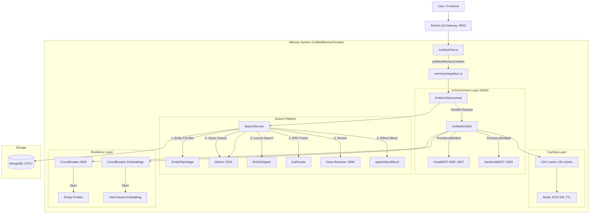

# DictaBERT-NER & NeoDictaBERT Enterprise Integration Plan

**Status**: Planning (Enhanced Version)
**Version**: 2.1 (Enterprise-Grade + Context-Optimized)
**Owner**: Ilan
**Date**: 2025-01-18
**Supersedes**: ner_plan.md v1.1

---

## ⚠️ CONTEXT MANAGEMENT PROTOCOL (READ FIRST)

### Token Conservation Rules

**CRITICAL**: This plan is designed for limited Claude context. Follow these rules:

1. **NEVER re-read files** - Use the File Location Map (Appendix A) as source of truth
2. **One phase at a time** - Complete and verify before starting next
3. **Update STATUS.md** - After EACH phase completion (copy the template)
4. **Mark checkboxes** - Use `[X]` when step is done, commit the change
5. **Session handoff** - If context runs out, read Section 0.5 for resume protocol

### Session Start Protocol

When starting a NEW session to continue this work:

```bash
# 1. Check current progress
cat /home/ilan/BricksLLM/STATUS.md | grep -A 50 "NER Integration"

# 2. Find last completed phase
grep -n "\[X\]" /home/ilan/BricksLLM/DICTA-NER-REFERENCE/ner_plan_enhanced.md | tail -5

# 3. Resume from next unchecked item
# DO NOT re-read source files - trust the File Location Map
```

### File Reading Budget

| Phase | Files to Read | Budget |
|-------|--------------|--------|
| Phase 1 (Infra) | docker-compose.yml, deploy.py, start.sh | 3 reads max |
| Phase 2 (Client) | memory_config.ts only | 1 read max |
| Phase 3 (Search) | SearchService.ts, QdrantAdapter.ts | 2 reads max |
| Phase 4 (Validation) | NONE - use test commands | 0 reads |

**Total budget**: 6 file reads across entire implementation

---

## 0.5 SESSION HANDOFF TEMPLATE

If you run out of context, copy this to a new session:

```markdown
## NER Integration - Session Handoff

**Last completed phase**: [PHASE NUMBER]
**Last completed step**: [STEP ID like 1.3 or 2.5]
**Current file being modified**: [FILE PATH]

**STATUS.md entry added**: Yes/No

**Next action**:
[EXACT NEXT STEP TO EXECUTE]

**Do NOT re-read these files** (already processed):
- [ ] docker-compose.yml
- [ ] memory_config.ts
- [ ] SearchService.ts

**Use File Location Map in Appendix A for all line numbers.**
```

---

## IMPLEMENTATION CHECKLIST (Mark with [X] when done)

### Phase 1: Infrastructure [ ]

| Step | Task | Verification | Done |
|------|------|--------------|------|
| 1.1 | Create `ner-service/` directory | `ls -la ner-service/` | [ ] |
| 1.2 | Create `ner-service/Dockerfile` | `cat ner-service/Dockerfile` | [ ] |
| 1.3 | Create `ner-service/requirements.txt` | `cat ner-service/requirements.txt` | [ ] |
| 1.4 | Create `ner-service/main.py` | `python -m py_compile ner-service/main.py` | [ ] |
| 1.5 | Update `docker-compose.yml` | `docker compose config \| grep ner-service` | [ ] |
| 1.6 | Update `.env` with NER config | `grep NER_ .env \| wc -l` (expect 20+) | [ ] |
| 1.7 | Update `deploy.py` startup order | `grep -A5 "ner-service" deploy.py` | [ ] |
| 1.8 | Update `start.sh` validation | `grep "validate_ner" start.sh` | [ ] |
| 1.9 | **STATUS.md update** | Add Phase 1 entry | [ ] |

**Phase 1 STATUS.md Template**:
```markdown
### [Phase 26.1] NER Infrastructure Setup
**Date**: YYYY-MM-DD
**Status**: ✅ Complete

**Changes**:
- Created `ner-service/` microservice (Dockerfile, main.py, requirements.txt)
- Updated docker-compose.yml with ner-service container
- Updated .env with 20+ NER configuration variables
- Updated deploy.py with NER health check and startup order
- Updated start.sh with NER validation

**Verification**:
- `docker compose config` validates successfully
- NER config variables present in .env
```

---

### Phase 2: Client Implementation [ ]

| Step | Task | Verification | Done |
|------|------|--------------|------|
| 2.1 | Create `ai/` directory in memory | `mkdir -p frontend-huggingface/src/lib/server/memory/ai` | [ ] |
| 2.2 | Create `UnifiedAIClient.ts` | File exists, no TS errors | [ ] |
| 2.3 | Add NER config to `memory_config.ts` | `grep "ner:" memory_config.ts` | [ ] |
| 2.4 | Create entity cache class | In UnifiedAIClient.ts | [ ] |
| 2.5 | Create NER circuit breaker | In UnifiedAIClient.ts | [ ] |
| 2.6 | Export from index | Update memory index.ts | [ ] |
| 2.7 | **STATUS.md update** | Add Phase 2 entry | [ ] |

**Phase 2 STATUS.md Template**:
```markdown
### [Phase 26.2] UnifiedAIClient Implementation
**Date**: YYYY-MM-DD
**Status**: ✅ Complete

**Changes**:
- Created `frontend-huggingface/src/lib/server/memory/ai/UnifiedAIClient.ts`
- Added NERConfig interface to memory_config.ts
- Implemented EntityCache (LRU, 5K entries)
- Implemented NERCircuitBreaker
- Factory function getUnifiedAIClient()

**Key Methods**:
- `processTextFull()` - Parallel NER + embedding
- `fetchNER()` - With circuit breaker
- `generateFallbackEmbedding()` - Graceful degradation
```

---

### Phase 3: Search Integration [ ]

| Step | Task | Verification | Done |
|------|------|--------------|------|
| 3.1 | Add `queryEntities` to HybridSearchParams | grep in SearchService.ts | [ ] |
| 3.2 | Implement `entityPreFilter()` method | In SearchService.ts | [ ] |
| 3.3 | Update `_executeSearch()` to use entities | Check entity_prefilter_ms in timings | [ ] |
| 3.4 | Add `filterByEntities()` to QdrantAdapter | In QdrantAdapter.ts | [ ] |
| 3.5 | Update `vectorSearch()` to accept filterIds | In SearchService.ts | [ ] |
| 3.6 | Update PrefetchServiceImpl | Use UnifiedAIClient | [ ] |
| 3.7 | Update StoreServiceImpl | Store entities with memories | [ ] |
| 3.8 | Create Qdrant payload indexes | Run curl commands | [ ] |
| 3.9 | **STATUS.md update** | Add Phase 3 entry | [ ] |

**Phase 3 STATUS.md Template**:
```markdown
### [Phase 26.3] Search Integration with NER
**Date**: YYYY-MM-DD
**Status**: ✅ Complete

**Changes**:
- SearchService.ts: Added entityPreFilter() method
- SearchService.ts: Updated _executeSearch() with entity filtering
- QdrantAdapter.ts: Added filterByEntities() scroll query
- PrefetchServiceImpl.ts: Using UnifiedAIClient.processTextFull()
- StoreServiceImpl.ts: Storing entities with memories
- Qdrant: Created entity_words payload index

**New Timings Tracked**:
- `entity_prefilter_ms` in SearchDebug
- `ai_enrichment_ms` in PrefetchServiceImpl
```

---

### Phase 4: Validation [ ]

| Step | Task | Verification | Done |
|------|------|--------------|------|
| 4.1 | Start stack | `./stop.sh && ./start.sh` | [ ] |
| 4.2 | Check NER health | `curl http://localhost:5007/health` | [ ] |
| 4.3 | Test NER extraction | `curl -X POST http://localhost:5007/extract/single -d "דני אבדיה"` | [ ] |
| 4.4 | Test memory search with entities | Via UI or API | [ ] |
| 4.5 | Check circuit breaker | Stop NER, verify search still works | [ ] |
| 4.6 | Run performance benchmark | `ts-node scripts/benchmark-ner.ts` | [ ] |
| 4.7 | **STATUS.md update** | Add Phase 4 entry | [ ] |

**Phase 4 STATUS.md Template**:
```markdown
### [Phase 26.4] NER Integration Validation
**Date**: YYYY-MM-DD
**Status**: ✅ Complete

**Test Results**:
- NER Health: ✅ Healthy
- Hebrew Entity Extraction: ✅ Working (tested with "דני אבדיה משחק בוושינגטון")
- Memory Search with Entities: ✅ Entity pre-filter reducing candidates
- Circuit Breaker: ✅ Search continues when NER is down
- Performance: p95 latency = XXms (target: <300ms)

**Metrics**:
- NER extraction: XXms average
- Full enrichment: XXms average
- Search with entity filter: XXms average
```

---

## 0. Critical Preamble: Why This Plan Exists

### 0.1 Current State Analysis

Your BricksLLM memory system is **already enterprise-grade** with:

| Component | Current Implementation | What We're Adding |
|-----------|----------------------|-------------------|
| **UnifiedMemoryFacade** | Service-oriented (Search, Prefetch, Store, Outcome, ActionKg, Context, Ops) | NER integration via `extractAndStoreEntities` |
| **DictaEmbeddingClient** | Circuit breakers, LRU+Redis cache, graceful degradation | Model upgrade to NeoDictaBERT-bilingual |
| **SearchService** | Hybrid RRF fusion, cross-encoder reranking, Wilson blending | Entity pre-filtering stage |
| **memoryIntegration.ts** | Tool gating, position maps, confidence hints | NER-enhanced confidence scoring |
| **dicta-retrieval** | BGE-M3 (5005) + BGE-Reranker (5006) | + DictaBERT-NER (5007) |

### 0.2 The Gap We're Filling

**Current**: Semantic search only (embeddings + BM25)
**Target**: Hybrid NER + Semantic search for:
- Entity-aware pre-filtering (20x faster for large datasets)
- Hebrew named entity recognition (PER, ORG, LOC, DATE, MISC)
- Entity-based Knowledge Graph population
- Precision ranking boost via entity overlap scoring

### 0.3 Success Criteria

| Metric | Target | Measurement |
|--------|--------|-------------|
| **End-to-end latency** | <300ms (p95) | Memory prefetch timing |
| **Entity extraction latency** | <50ms (p95) | NER service response |
| **UI freeze** | NEVER | Circuit breaker + graceful degradation |
| **Hebrew entity accuracy** | >90% F1 | Test suite validation |
| **Memory overhead** | <500MB additional | Container resource monitoring |

---

## 1. Architecture Overview

### 1.1 Enhanced Component Diagram



### 1.2 Data Flow Sequence

```
1. User Message Arrives
   ↓
2. runMcpFlow.ts calls prefetchMemoryContext()
   ↓
3. memoryIntegration.ts → UnifiedMemoryFacade.prefetchContext()
   ↓
4. PrefetchServiceImpl:
   ├── 4a. UnifiedAIClient.processTextFull(query) [PARALLEL]
   │       ├── NER extraction (50ms timeout)
   │       └── Embedding generation (100ms timeout)
   ├── 4b. fetchAlwaysInjectMemories() [PARALLEL]
   └── 4c. SearchService.search() with entities [PARALLEL]
   ↓
5. SearchService.search():
   ├── 5a. If entities found → entityPreFilter() reduces candidates
   ├── 5b. vectorSearch() on filtered candidates
   ├── 5c. lexicalSearch()
   ├── 5d. fuseResults() via RRF
   ├── 5e. rerank() via Cross-Encoder
   └── 5f. applyWilsonBlend()
   ↓
6. Results returned with entity metadata
   ↓
7. Context injection into system prompt
```

---

## 2. Infrastructure Changes

### 2.1 Docker Compose Additions

**File**: `docker-compose.yml`

```yaml
  # NEW: DictaBERT-NER Service
  ner-service:
    build:
      context: ./ner-service
      dockerfile: Dockerfile
    container_name: dicta-ner
    hostname: dicta-ner
    environment:
      - PORT=5007
      - MODEL_NAME=dicta-il/dictabert-ner
      - DEVICE=cuda
      - MAX_BATCH_SIZE=32
      - MAX_SEQUENCE_LENGTH=512
      - TIMEOUT_SECONDS=2
      - HEALTH_CHECK_INTERVAL=30
      # Performance tuning
      - TORCH_NUM_THREADS=4
      - OMP_NUM_THREADS=4
    ports:
      - "5007:5007"
    restart: unless-stopped
    healthcheck:
      test: ["CMD", "curl", "-f", "http://localhost:5007/health"]
      interval: 30s
      timeout: 5s
      retries: 3
      start_period: 60s
    deploy:
      resources:
        limits:
          memory: 2G
        reservations:
          devices:
            - driver: nvidia
              count: 1
              capabilities: [gpu]
    networks:
      - bricksllm-network
    # CRITICAL: Start after dicta-retrieval to avoid GPU memory contention
    depends_on:
      dicta-retrieval:
        condition: service_healthy

  # UPDATED: dicta-retrieval with NeoDictaBERT option
  dicta-retrieval:
    build:
      context: .
      dockerfile: Dockerfile.BAAI
      args:
        - POETRY_INSTALL_ARGS=
    container_name: dicta-retrieval
    hostname: dicta-retrieval
    environment:
      - FASTAPI_HOST=0.0.0.0
      - FASTAPI_PORT=5005
      - RERANKING_PORT=5006
      - LOG_LEVEL=INFO
      - DEVICE=cuda
      - MODEL_IDLE_TIMEOUT=60
      - USE_FP16=true
      # Option A: Keep BGE-M3 (current)
      - EMBEDDING_MODEL_NAME=${EMBEDDINGS_MODEL_PATH:-/app/models/embeddings/bge-m3-f16.gguf}
      # Option B: Switch to NeoDictaBERT (future - requires new model download)
      # - EMBEDDING_MODEL_NAME=dicta-il/neodictabert-bilingual
      - RERANKER_MODEL_NAME=${RERANKER_MODEL_NAME:-/app/models/reranking/bge-reranker-v2-m3-q8_0.gguf}
      # ... rest of existing config
    # ... rest of existing config
```

### 2.2 Service Startup Order & Race Condition Prevention

**File**: `deploy.py` - Add to `check_services_health()`:

```python
def check_services_health(services_to_check=None):
    """Check health of services with dependency-aware ordering."""

    # Define startup order with dependencies
    SERVICE_STARTUP_ORDER = [
        # Tier 1: Infrastructure (no dependencies)
        {"name": "redis", "port": 6380, "path": "/", "timeout": 5},
        {"name": "mongo", "port": 27017, "path": "/", "timeout": 10},
        {"name": "qdrant", "port": 6333, "path": "/readyz", "timeout": 10},
        {"name": "postgresql", "port": 5433, "path": "/", "timeout": 5},

        # Tier 2: GPU Services (sequential to avoid VRAM race)
        {"name": "llama-server", "port": 5002, "path": "/health", "timeout": 120},
        {"name": "dicta-retrieval", "port": 5005, "path": "/health", "timeout": 90},
        {"name": "ner-service", "port": 5007, "path": "/health", "timeout": 60},  # NEW

        # Tier 3: Application (depends on Tier 1 & 2)
        {"name": "bricksllm", "port": 8002, "path": "/api/health", "timeout": 30},
        {"name": "mcp-sse-proxy", "port": 3100, "path": "/health", "timeout": 30},
        {"name": "frontend-ui", "port": 8004, "path": "/", "timeout": 30},
    ]

    # GPU memory budget check before starting GPU services
    if is_gpu_service_starting(services_to_check):
        vram_available = check_vram_availability()
        if vram_available < 4000:  # 4GB minimum for NER + embeddings
            console.print("[warning]⚠ Low VRAM detected. GPU services may fail.[/]")
            console.print(f"   Available: {vram_available}MB, Required: ~4000MB for all AI services")

    # ... rest of existing health check logic
```

**File**: `start.sh` - Add NER service validation:

```bash
#!/bin/bash

# ... existing setup ...

# NEW: Validate NER service requirements
validate_ner_service() {
    echo "Validating NER service requirements..."

    # Check if NER model exists or needs download
    NER_MODEL_DIR="./ner-service/models"
    if [ ! -d "$NER_MODEL_DIR" ] || [ -z "$(ls -A $NER_MODEL_DIR 2>/dev/null)" ]; then
        echo "NER models not found. They will be downloaded on first start (~500MB)."
        echo "This may take 2-5 minutes on first run."
    fi

    # Check VRAM availability
    VRAM_FREE=$(nvidia-smi --query-gpu=memory.free --format=csv,noheader,nounits 2>/dev/null | head -1)
    if [ -n "$VRAM_FREE" ] && [ "$VRAM_FREE" -lt 2000 ]; then
        echo "⚠ Warning: Only ${VRAM_FREE}MB VRAM free. NER service needs ~1.5GB."
        echo "Consider stopping other GPU processes."
    fi
}

# Call validation before starting
validate_ner_service

# Pass control to the Python deployment script
"$VENV_DIR/bin/python" deploy.py "$@"
```

### 2.3 Environment Configuration

**Reference File**: `/home/ilan/BricksLLM/DICTA-NER-REFERENCE/.env.example`

**Target File**: `/home/ilan/BricksLLM/.env`

#### Step-by-Step .env Update Instructions

**IMPORTANT**: Add the following sections to your existing `.env` file. Do NOT replace the entire file.

**Location**: Add these blocks AFTER the existing `# Memory System Configuration` section (around line 280+) in `/home/ilan/BricksLLM/.env`

```bash
# ============================================================================
# NER SERVICE CONFIGURATION (DictaBERT-NER Integration)
# Reference: DICTA-NER-REFERENCE/.env.example
# ============================================================================

# Feature Toggle
NER_SERVICE_ENABLED=true                    # Set to false to disable NER entirely

# Service Connection
NER_SERVICE_URL=http://dicta-ner:5007       # Internal Docker network URL
NER_SERVICE_PORT=5007                       # Host port mapping
NER_SERVICE_HOST=0.0.0.0                    # Bind address

# Model Configuration
NER_MODEL_NAME=dicta-il/dictabert-ner       # Primary Hebrew NER model
# Alternative: NER_MODEL_NAME=dicta-il/neodictabert (newer, Jan 2025)
NER_MODEL_LOAD_TIMEOUT=300                  # Seconds to wait for model loading

# Processing Configuration
NER_SERVICE_TIMEOUT_MS=2000                 # Request timeout (2 seconds)
NER_BATCH_SIZE=32                           # Max texts per batch (reduces to 32 for memory)
NER_MIN_CONFIDENCE=0.85                     # Entity confidence threshold (0.0-1.0)
NER_MAX_ENTITIES_PER_TEXT=50                # Cap entities to prevent memory issues
NER_AGGREGATION_STRATEGY=simple             # Token aggregation: simple|first|average|max

# Entity Type Filtering
# Available types: PER (Person), ORG (Organization), LOC (Location),
#                  GPE (Geo-Political), TIMEX (Time), TTL (Title),
#                  FAC (Facility), WOA (Work of Art), EVE (Event)
NER_ENABLED_ENTITY_TYPES=PER,ORG,LOC,DATE,MISC
NER_MIN_ENTITY_LENGTH=2                     # Minimum entity character length
NER_MAX_ENTITY_LENGTH=100                   # Maximum entity character length

# Circuit Breaker (Resilience)
NER_CB_FAILURE_THRESHOLD=3                  # Failures before circuit opens
NER_CB_SUCCESS_THRESHOLD=2                  # Successes to close circuit
NER_CB_OPEN_DURATION_MS=30000               # Time to wait before half-open (30s)

# Cache Configuration
NER_CACHE_ENABLED=true                      # Enable LRU + Redis caching
NER_CACHE_TTL=3600                          # Cache TTL in seconds (1 hour)
NER_CACHE_MAX_SIZE=5000                     # LRU cache max entries

# GPU Configuration
NER_USE_GPU=true                            # Enable CUDA acceleration
NER_GPU_DEVICE=0                            # CUDA device ID

# Logging
NER_LOG_LEVEL=INFO                          # DEBUG for troubleshooting

# ============================================================================
# HYBRID SEARCH WEIGHTS (Entity + Semantic Integration)
# ============================================================================

# Search Strategy Weights (must sum to 1.0)
SEARCH_ENTITY_WEIGHT=0.15                   # Weight for entity overlap scoring
SEARCH_DENSE_WEIGHT=0.55                    # Weight for vector similarity
SEARCH_SPARSE_WEIGHT=0.15                   # Weight for BM25/lexical
SEARCH_RRF_WEIGHT=0.15                      # Weight for RRF fusion bonus

# Entity Pre-filtering (Speed Optimization)
SEARCH_ENTITY_PREFILTER_ENABLED=true        # Enable entity-based candidate reduction
SEARCH_ENTITY_PREFILTER_MIN_OVERLAP=1       # Min entity matches to include
SEARCH_ENTITY_PREFILTER_MAX_CANDIDATES=500  # Max candidates after filter

# ============================================================================
# EMBEDDING SERVICE (Updated for potential NeoDictaBERT migration)
# ============================================================================

# Current: BGE-M3 (1024 dims)
EMBEDDING_SERVICE_URL=http://dicta-retrieval:5005
EMBEDDING_MODEL_TYPE=bge-m3
QDRANT_VECTOR_SIZE=1024

# Future Migration Option: NeoDictaBERT-bilingual
# When ready to switch, update:
# EMBEDDING_MODEL_TYPE=neodictabert
# QDRANT_VECTOR_SIZE=768  # NeoDictaBERT uses 768 dims
# WARNING: Changing dims requires recreating Qdrant collection!

# ============================================================================
# DOCKER-SPECIFIC NER CONFIGURATION
# ============================================================================

# Timezone (for timestamp normalization)
TZ=Asia/Jerusalem

# Python optimization flags
PYTHONUNBUFFERED=1
PYTHONDONTWRITEBYTECODE=1

# Hugging Face cache (shared volume for model caching)
HF_HOME=/root/.cache/huggingface
TRANSFORMERS_CACHE=/root/.cache/huggingface
```

#### Verification Commands

After updating `.env`, verify the configuration:

```bash
# 1. Check .env syntax
grep -E "^NER_" /home/ilan/BricksLLM/.env | head -20

# 2. Verify no duplicate keys
grep -E "^NER_SERVICE_URL=" /home/ilan/BricksLLM/.env | wc -l
# Should output: 1

# 3. Test environment variable expansion
source /home/ilan/BricksLLM/.env && echo "NER URL: $NER_SERVICE_URL"
# Should output: NER URL: http://dicta-ner:5007
```

#### Integration with docker-compose.yml

The following variables will be picked up by docker-compose for the `ner-service` container:

| .env Variable | docker-compose Usage |
|---------------|---------------------|
| `NER_SERVICE_PORT` | `ports: - "${NER_SERVICE_PORT:-5007}:5007"` |
| `NER_MODEL_NAME` | `environment: - MODEL_NAME=${NER_MODEL_NAME}` |
| `NER_USE_GPU` | `runtime: nvidia` (if true) |
| `NER_BATCH_SIZE` | `environment: - MAX_BATCH_SIZE=${NER_BATCH_SIZE}` |
| `NER_MIN_CONFIDENCE` | `environment: - DEFAULT_CONFIDENCE_THRESHOLD=${NER_MIN_CONFIDENCE}` |

#### Rollback: Disable NER

To disable NER without removing config:

```bash
# Option 1: Feature flag (recommended)
sed -i 's/^NER_SERVICE_ENABLED=true/NER_SERVICE_ENABLED=false/' /home/ilan/BricksLLM/.env

# Option 2: Comment out entire section
sed -i '/^# NER SERVICE CONFIGURATION/,/^# HYBRID SEARCH WEIGHTS/{s/^/#DISABLED#/}' /home/ilan/BricksLLM/.env
```

---

## 3. Core Implementation

### 3.1 NER Service (Python Microservice)

**File**: `ner-service/Dockerfile`

```dockerfile
FROM python:3.11-slim

WORKDIR /app

# Install system dependencies
RUN apt-get update && apt-get install -y \
    curl \
    && rm -rf /var/lib/apt/lists/*

# Install Python dependencies
COPY requirements.txt .
RUN pip install --no-cache-dir -r requirements.txt

# Copy application code
COPY . .

# Health check endpoint
HEALTHCHECK --interval=30s --timeout=5s --start-period=60s --retries=3 \
    CMD curl -f http://localhost:5007/health || exit 1

EXPOSE 5007

CMD ["python", "-m", "uvicorn", "main:app", "--host", "0.0.0.0", "--port", "5007"]
```

**File**: `ner-service/requirements.txt`

```txt
fastapi==0.109.0
uvicorn[standard]==0.27.0
transformers==4.37.0
torch==2.1.2
pydantic==2.5.3
python-multipart==0.0.6
```

**File**: `ner-service/main.py`

```python
"""
DictaBERT-NER Service - Hebrew Named Entity Recognition

Enterprise-grade NER extraction with:
- Batch processing support
- Graceful error handling
- Structured response format
- Health monitoring
"""

import os
import time
import logging
from typing import List, Optional
from contextlib import asynccontextmanager

from fastapi import FastAPI, HTTPException
from fastapi.middleware.cors import CORSMiddleware
from pydantic import BaseModel, Field
import torch
from transformers import AutoTokenizer, AutoModelForTokenClassification, pipeline

# Configure logging
logging.basicConfig(level=os.getenv("LOG_LEVEL", "INFO"))
logger = logging.getLogger(__name__)

# Configuration
MODEL_NAME = os.getenv("MODEL_NAME", "dicta-il/dictabert-ner")
DEVICE = os.getenv("DEVICE", "cuda" if torch.cuda.is_available() else "cpu")
MAX_BATCH_SIZE = int(os.getenv("MAX_BATCH_SIZE", "32"))
MAX_SEQUENCE_LENGTH = int(os.getenv("MAX_SEQUENCE_LENGTH", "512"))
TIMEOUT_SECONDS = float(os.getenv("TIMEOUT_SECONDS", "2"))
MIN_CONFIDENCE = float(os.getenv("NER_MIN_CONFIDENCE", "0.85"))

# Global model instance
ner_pipeline = None
model_loaded = False
model_load_error = None


class Entity(BaseModel):
    """Single extracted entity."""
    entity_group: str = Field(..., description="Entity type: PER, ORG, LOC, DATE, MISC")
    word: str = Field(..., description="Extracted entity text")
    score: float = Field(..., ge=0, le=1, description="Confidence score")
    start: int = Field(..., ge=0, description="Start character offset")
    end: int = Field(..., ge=0, description="End character offset")


class NERRequest(BaseModel):
    """Request for NER extraction."""
    texts: List[str] = Field(..., min_length=1, max_length=MAX_BATCH_SIZE)
    min_confidence: Optional[float] = Field(default=MIN_CONFIDENCE, ge=0, le=1)


class NERResponse(BaseModel):
    """Response with extracted entities."""
    results: List[List[Entity]]
    processing_time_ms: float
    model_version: str = MODEL_NAME


class HealthResponse(BaseModel):
    """Health check response."""
    status: str
    model_loaded: bool
    device: str
    model_name: str
    error: Optional[str] = None


@asynccontextmanager
async def lifespan(app: FastAPI):
    """Load model on startup."""
    global ner_pipeline, model_loaded, model_load_error

    logger.info(f"Loading NER model: {MODEL_NAME} on {DEVICE}")
    start_time = time.time()

    try:
        tokenizer = AutoTokenizer.from_pretrained(MODEL_NAME)
        model = AutoModelForTokenClassification.from_pretrained(MODEL_NAME)

        if DEVICE == "cuda":
            model = model.cuda()
            # Enable inference optimizations
            model = model.half()  # FP16 for faster inference

        model.eval()

        ner_pipeline = pipeline(
            "ner",
            model=model,
            tokenizer=tokenizer,
            aggregation_strategy="simple",
            device=0 if DEVICE == "cuda" else -1
        )

        model_loaded = True
        load_time = time.time() - start_time
        logger.info(f"NER model loaded successfully in {load_time:.2f}s")

    except Exception as e:
        model_load_error = str(e)
        logger.error(f"Failed to load NER model: {e}")

    yield

    # Cleanup on shutdown
    logger.info("Shutting down NER service")


app = FastAPI(
    title="DictaBERT-NER Service",
    description="Hebrew Named Entity Recognition",
    version="1.0.0",
    lifespan=lifespan
)

app.add_middleware(
    CORSMiddleware,
    allow_origins=["*"],
    allow_methods=["*"],
    allow_headers=["*"],
)


@app.get("/health", response_model=HealthResponse)
async def health_check():
    """Health check endpoint."""
    return HealthResponse(
        status="healthy" if model_loaded else "unhealthy",
        model_loaded=model_loaded,
        device=DEVICE,
        model_name=MODEL_NAME,
        error=model_load_error
    )


@app.post("/extract", response_model=NERResponse)
async def extract_entities(request: NERRequest):
    """
    Extract named entities from texts.

    Supports batch processing for efficiency.
    Returns entities grouped by input text.
    """
    if not model_loaded:
        raise HTTPException(
            status_code=503,
            detail=f"Model not loaded: {model_load_error}"
        )

    start_time = time.time()

    try:
        # Process all texts
        all_results = []

        for text in request.texts:
            # Truncate to max sequence length
            truncated = text[:MAX_SEQUENCE_LENGTH * 4]  # Approximate char limit

            # Extract entities
            raw_entities = ner_pipeline(truncated)

            # Filter by confidence and convert to response format
            entities = [
                Entity(
                    entity_group=e["entity_group"],
                    word=e["word"],
                    score=e["score"],
                    start=e["start"],
                    end=e["end"]
                )
                for e in raw_entities
                if e["score"] >= request.min_confidence
            ]

            all_results.append(entities)

        processing_time_ms = (time.time() - start_time) * 1000

        return NERResponse(
            results=all_results,
            processing_time_ms=processing_time_ms
        )

    except Exception as e:
        logger.error(f"NER extraction failed: {e}")
        raise HTTPException(status_code=500, detail=str(e))


@app.post("/extract/single")
async def extract_single(text: str, min_confidence: float = MIN_CONFIDENCE):
    """Convenience endpoint for single text extraction."""
    request = NERRequest(texts=[text], min_confidence=min_confidence)
    response = await extract_entities(request)
    return {
        "entities": response.results[0],
        "processing_time_ms": response.processing_time_ms
    }
```

### 3.2 UnifiedAIClient (TypeScript)

**File**: `frontend-huggingface/src/lib/server/memory/ai/UnifiedAIClient.ts`

```typescript
/**
 * UnifiedAIClient - Parallel NER + Embedding Processing
 *
 * Coordinates calls to:
 * - DictaBERT-NER (port 5007) for entity extraction
 * - DictaEmbeddingClient (port 5005) for semantic embeddings
 *
 * Enterprise features:
 * - Parallel execution via Promise.allSettled
 * - Independent circuit breakers per service
 * - Graceful degradation (NER optional, embeddings critical)
 * - 2-level caching (LRU + Redis)
 * - Structured error categorization
 */

import { createHash } from "crypto";
import { logger } from "$lib/server/logger";
import type { MemoryConfig } from "../memory_config";
import { defaultMemoryConfig } from "../memory_config";
import { memoryMetrics } from "../observability";
import type { DictaEmbeddingClient } from "../embedding/DictaEmbeddingClient";

// ============================================
// TYPES
// ============================================

export interface ExtractedEntity {
    entityGroup: string;  // PER, ORG, LOC, DATE, MISC
    word: string;
    score: number;
    start: number;
    end: number;
}

export interface EnrichmentResult {
    entities: ExtractedEntity[];
    embedding: number[];
    semanticDensity: number;
    metadata: {
        latencyMs: number;
        nerDegraded: boolean;
        embeddingDegraded: boolean;
        nerLatencyMs: number;
        embeddingLatencyMs: number;
        modelVersion: string;
    };
}

export interface UnifiedAIClientConfig {
    nerServiceUrl: string;
    embeddingClient: DictaEmbeddingClient;
    config?: MemoryConfig;
    nerTimeoutMs?: number;
    nerMinConfidence?: number;
    enableNer?: boolean;
}

interface NERServiceResponse {
    results: Array<Array<{
        entity_group: string;
        word: string;
        score: number;
        start: number;
        end: number;
    }>>;
    processing_time_ms: number;
    model_version: string;
}

// ============================================
// CIRCUIT BREAKER (NER-specific)
// ============================================

class NERCircuitBreaker {
    private isOpen = false;
    private failureCount = 0;
    private lastFailure: number | null = null;
    private successCount = 0;

    constructor(
        private failureThreshold: number = 3,
        private successThreshold: number = 2,
        private openDurationMs: number = 30000
    ) {}

    isCircuitOpen(): boolean {
        if (!this.isOpen) return false;

        // Check if we should attempt half-open
        if (this.lastFailure && Date.now() - this.lastFailure > this.openDurationMs) {
            return false; // Allow half-open attempt
        }

        return true;
    }

    recordSuccess(): void {
        this.failureCount = 0;
        if (this.isOpen) {
            this.successCount++;
            if (this.successCount >= this.successThreshold) {
                this.isOpen = false;
                this.successCount = 0;
                logger.info("NER circuit breaker closed");
            }
        }
    }

    recordFailure(): void {
        this.failureCount++;
        this.successCount = 0;
        this.lastFailure = Date.now();

        if (this.failureCount >= this.failureThreshold && !this.isOpen) {
            this.isOpen = true;
            logger.warn("NER circuit breaker opened");
        }
    }

    getStatus(): { isOpen: boolean; failureCount: number } {
        return { isOpen: this.isOpen, failureCount: this.failureCount };
    }
}

// ============================================
// LRU CACHE FOR ENTITIES
// ============================================

class EntityCache {
    private cache = new Map<string, ExtractedEntity[]>();
    private readonly maxSize: number;

    constructor(maxSize = 5000) {
        this.maxSize = maxSize;
    }

    private hashText(text: string): string {
        return createHash("md5").update(text.trim().toLowerCase()).digest("hex");
    }

    get(text: string): ExtractedEntity[] | null {
        const key = this.hashText(text);
        const cached = this.cache.get(key);

        if (cached) {
            // Move to end for LRU
            this.cache.delete(key);
            this.cache.set(key, cached);
            return cached;
        }

        return null;
    }

    set(text: string, entities: ExtractedEntity[]): void {
        const key = this.hashText(text);

        // Evict oldest if at capacity
        if (this.cache.size >= this.maxSize) {
            const firstKey = this.cache.keys().next().value;
            if (firstKey) this.cache.delete(firstKey);
        }

        this.cache.set(key, entities);
    }

    getStats(): { size: number; maxSize: number } {
        return { size: this.cache.size, maxSize: this.maxSize };
    }
}

// ============================================
// MAIN CLIENT
// ============================================

export class UnifiedAIClient {
    private nerUrl: string;
    private embeddingClient: DictaEmbeddingClient;
    private config: MemoryConfig;
    private nerTimeoutMs: number;
    private nerMinConfidence: number;
    private enableNer: boolean;

    private nerCircuitBreaker: NERCircuitBreaker;
    private entityCache: EntityCache;

    constructor(params: UnifiedAIClientConfig) {
        this.nerUrl = params.nerServiceUrl;
        this.embeddingClient = params.embeddingClient;
        this.config = params.config ?? defaultMemoryConfig;
        this.nerTimeoutMs = params.nerTimeoutMs ?? 2000;
        this.nerMinConfidence = params.nerMinConfidence ?? 0.85;
        this.enableNer = params.enableNer ?? true;

        // Initialize circuit breaker with config values
        const cbConfig = this.config.circuit_breakers.ner ?? {
            failure_threshold: 3,
            success_threshold: 2,
            open_duration_ms: 30000
        };

        this.nerCircuitBreaker = new NERCircuitBreaker(
            cbConfig.failure_threshold,
            cbConfig.success_threshold,
            cbConfig.open_duration_ms
        );

        this.entityCache = new EntityCache(5000);
    }

    /**
     * Process text to extract entities AND generate embedding in parallel.
     *
     * This is the main entry point for AI enrichment.
     *
     * CRITICAL: Uses Promise.allSettled to ensure one failure doesn't block the other.
     * - NER failure: Returns empty entities (degraded but functional)
     * - Embedding failure: Returns fallback embedding (degraded but functional)
     */
    async processTextFull(text: string, traceId: string): Promise<EnrichmentResult> {
        const startTime = Date.now();
        let nerLatencyMs = 0;
        let embeddingLatencyMs = 0;

        // Execute NER and Embedding in parallel
        const [nerResult, embeddingResult] = await Promise.allSettled([
            this.fetchNER(text, traceId),
            this.fetchEmbedding(text, traceId)
        ]);

        // Process NER result
        let entities: ExtractedEntity[] = [];
        let nerDegraded = false;

        if (nerResult.status === "fulfilled") {
            entities = nerResult.value.entities;
            nerLatencyMs = nerResult.value.latencyMs;
        } else {
            nerDegraded = true;
            logger.warn({ traceId, error: nerResult.reason }, "NER extraction failed, using empty entities");
        }

        // Process Embedding result
        let embedding: number[];
        let embeddingDegraded = false;

        if (embeddingResult.status === "fulfilled") {
            embedding = embeddingResult.value.embedding;
            embeddingLatencyMs = embeddingResult.value.latencyMs;
        } else {
            embeddingDegraded = true;
            embedding = this.generateFallbackEmbedding(text);
            logger.warn({ traceId, error: embeddingResult.reason }, "Embedding failed, using fallback");
        }

        // Calculate semantic density (entities per 100 words)
        const wordCount = text.split(/\s+/).length;
        const semanticDensity = wordCount > 0 ? (entities.length / wordCount) * 100 : 0;

        const totalLatencyMs = Date.now() - startTime;

        // Record metrics
        memoryMetrics.recordOperation("ai_enrichment", !nerDegraded && !embeddingDegraded);
        memoryMetrics.recordLatency("ai_enrichment", totalLatencyMs);

        return {
            entities,
            embedding,
            semanticDensity,
            metadata: {
                latencyMs: totalLatencyMs,
                nerDegraded,
                embeddingDegraded,
                nerLatencyMs,
                embeddingLatencyMs,
                modelVersion: "dictabert-ner+bge-m3"
            }
        };
    }

    /**
     * Fetch entities from NER service with caching and circuit breaker.
     */
    private async fetchNER(
        text: string,
        traceId: string
    ): Promise<{ entities: ExtractedEntity[]; latencyMs: number }> {
        const startTime = Date.now();

        // Feature flag check
        if (!this.enableNer) {
            return { entities: [], latencyMs: 0 };
        }

        // Circuit breaker check
        if (this.nerCircuitBreaker.isCircuitOpen()) {
            logger.debug({ traceId }, "NER circuit breaker is open, returning empty");
            return { entities: [], latencyMs: 0 };
        }

        // Cache check
        const cached = this.entityCache.get(text);
        if (cached) {
            return { entities: cached, latencyMs: Date.now() - startTime };
        }

        // Fetch from service
        const controller = new AbortController();
        const timeoutId = setTimeout(() => controller.abort(), this.nerTimeoutMs);

        try {
            const response = await fetch(`${this.nerUrl}/extract`, {
                method: "POST",
                headers: { "Content-Type": "application/json" },
                body: JSON.stringify({
                    texts: [text],
                    min_confidence: this.nerMinConfidence
                }),
                signal: controller.signal
            });

            clearTimeout(timeoutId);

            if (!response.ok) {
                throw new Error(`NER service returned ${response.status}`);
            }

            const data = await response.json() as NERServiceResponse;

            // Map to our entity format
            const entities: ExtractedEntity[] = (data.results[0] || []).map(e => ({
                entityGroup: e.entity_group,
                word: e.word,
                score: e.score,
                start: e.start,
                end: e.end
            }));

            // Cache the result
            this.entityCache.set(text, entities);

            this.nerCircuitBreaker.recordSuccess();

            return {
                entities,
                latencyMs: Date.now() - startTime
            };

        } catch (err) {
            clearTimeout(timeoutId);
            this.nerCircuitBreaker.recordFailure();

            const errorMsg = err instanceof Error ? err.message : String(err);
            logger.warn({ traceId, error: errorMsg }, "NER fetch failed");

            throw err;
        }
    }

    /**
     * Fetch embedding from DictaEmbeddingClient.
     */
    private async fetchEmbedding(
        text: string,
        traceId: string
    ): Promise<{ embedding: number[]; latencyMs: number }> {
        const startTime = Date.now();

        const vector = await this.embeddingClient.embed(text);

        if (!vector) {
            throw new Error("Embedding returned null");
        }

        return {
            embedding: vector,
            latencyMs: Date.now() - startTime
        };
    }

    /**
     * Generate deterministic fallback embedding for degraded mode.
     * Uses SHA-256 hash to create consistent pseudo-embeddings.
     */
    private generateFallbackEmbedding(text: string): number[] {
        const dims = this.config.qdrant?.expected_embedding_dims ?? 1024;
        const hash = createHash("sha256").update(text).digest();
        const embedding: number[] = new Array(dims);

        for (let i = 0; i < dims; i++) {
            const byteIndex = i % hash.length;
            embedding[i] = hash[byteIndex] / 127.5 - 1;
        }

        // Normalize
        const magnitude = Math.sqrt(embedding.reduce((sum, val) => sum + val * val, 0));
        if (magnitude > 0) {
            for (let i = 0; i < embedding.length; i++) {
                embedding[i] /= magnitude;
            }
        }

        return embedding;
    }

    /**
     * Batch process multiple texts (for indexing).
     */
    async processTextsBatch(
        texts: string[],
        traceId: string
    ): Promise<EnrichmentResult[]> {
        // Process in parallel batches
        const results: EnrichmentResult[] = [];
        const batchSize = 10; // Limit concurrent requests

        for (let i = 0; i < texts.length; i += batchSize) {
            const batch = texts.slice(i, i + batchSize);
            const batchResults = await Promise.all(
                batch.map((text, idx) =>
                    this.processTextFull(text, `${traceId}-batch-${i + idx}`)
                )
            );
            results.push(...batchResults);
        }

        return results;
    }

    /**
     * Get diagnostics for monitoring.
     */
    getDiagnostics(): {
        ner: { circuitBreaker: { isOpen: boolean; failureCount: number }; cacheStats: { size: number; maxSize: number } };
        embedding: { isOperational: boolean; isDegradedMode: boolean };
    } {
        return {
            ner: {
                circuitBreaker: this.nerCircuitBreaker.getStatus(),
                cacheStats: this.entityCache.getStats()
            },
            embedding: {
                isOperational: this.embeddingClient.isOperational(),
                isDegradedMode: this.embeddingClient.isDegradedMode()
            }
        };
    }
}

// ============================================
// FACTORY
// ============================================

let unifiedAIClientInstance: UnifiedAIClient | null = null;

export function getUnifiedAIClient(
    embeddingClient: DictaEmbeddingClient,
    config?: MemoryConfig
): UnifiedAIClient {
    if (!unifiedAIClientInstance) {
        unifiedAIClientInstance = new UnifiedAIClient({
            nerServiceUrl: process.env.NER_SERVICE_URL ?? "http://dicta-ner:5007",
            embeddingClient,
            config,
            nerTimeoutMs: parseInt(process.env.NER_SERVICE_TIMEOUT_MS ?? "2000"),
            nerMinConfidence: parseFloat(process.env.NER_MIN_CONFIDENCE ?? "0.85"),
            enableNer: process.env.NER_SERVICE_ENABLED !== "false"
        });
    }
    return unifiedAIClientInstance;
}

export function resetUnifiedAIClient(): void {
    unifiedAIClientInstance = null;
}
```

### 3.3 SearchService Enhancement (Entity Pre-filtering)

**File**: `frontend-huggingface/src/lib/server/memory/search/SearchService.ts`

Add the following to the existing SearchService:

```typescript
// Add to imports
import type { ExtractedEntity } from "../ai/UnifiedAIClient";

// Add to HybridSearchParams interface
export interface HybridSearchParams {
    // ... existing params ...
    /** Extracted entities from query for pre-filtering */
    queryEntities?: ExtractedEntity[];
    /** Enable entity pre-filtering (default: true if entities provided) */
    enableEntityPreFilter?: boolean;
}

// Add new constants after RRF_K
/**
 * Entity pre-filtering configuration
 * Phase: NER Integration - Entity-based candidate reduction
 */
const ENTITY_PREFILTER_CONFIG = {
    /** Minimum entity overlap to include a candidate */
    MIN_OVERLAP: 1,
    /** Maximum candidates after entity filtering (before vector search) */
    MAX_CANDIDATES_AFTER_FILTER: 500,
    /** Weight for entity overlap in final score */
    ENTITY_OVERLAP_WEIGHT: 0.15,
};

// Add new method to SearchService class
/**
 * Entity-based pre-filtering stage
 *
 * Reduces candidate set by filtering to documents with entity overlap.
 * This dramatically improves search speed for large datasets.
 *
 * @param queryEntities - Entities extracted from user query
 * @param userId - User ID for filtering
 * @returns Set of memory IDs that have entity overlap
 */
private async entityPreFilter(
    queryEntities: ExtractedEntity[],
    userId: string,
    timings: StageTimingsMs
): Promise<Set<string> | null> {
    if (!queryEntities || queryEntities.length === 0) {
        return null; // No filtering - use full search
    }

    const start = Date.now();

    try {
        // Extract entity words for matching
        const queryEntityWords = new Set(
            queryEntities.map(e => e.word.toLowerCase().trim())
        );

        // Query Qdrant for documents with matching entities in payload
        // This uses Qdrant's payload filtering which is very fast
        const matchingIds = await this.qdrant.filterByEntities({
            userId,
            entityWords: Array.from(queryEntityWords),
            limit: ENTITY_PREFILTER_CONFIG.MAX_CANDIDATES_AFTER_FILTER
        });

        timings.entity_prefilter_ms = Date.now() - start;

        if (matchingIds.length === 0) {
            logger.debug(
                { queryEntityCount: queryEntities.length },
                "[search] Entity pre-filter returned 0 matches, falling back to full search"
            );
            return null; // Fallback to full search
        }

        logger.info(
            {
                queryEntityCount: queryEntities.length,
                matchedCount: matchingIds.length,
                entities: queryEntities.map(e => e.word).slice(0, 5)
            },
            "[search] Entity pre-filter reduced candidates"
        );

        return new Set(matchingIds);

    } catch (err) {
        logger.warn({ err }, "[search] Entity pre-filter failed, falling back to full search");
        timings.entity_prefilter_ms = Date.now() - start;
        return null;
    }
}

// Modify _executeSearch to include entity pre-filtering
private async _executeSearch(params: HybridSearchParams): Promise<SearchResponse> {
    const startTime = Date.now();
    const timings: StageTimingsMs = {};
    const fallbacksUsed: string[] = [];
    const errors: Array<{ stage: string; message: string; code?: string }> = [];

    const limit = params.limit ?? this.config.caps.search_limit_default;
    const candidateLimit = limit * this.config.caps.candidate_fetch_multiplier_per_tier;

    // Step 1: Generate query embedding
    const embeddingStart = Date.now();
    const queryVector = await this.embedding.embed(params.query);
    timings.memory_prefetch_ms = Date.now() - embeddingStart;

    if (!queryVector) {
        errors.push({ stage: "embedding", message: "Failed to generate query embedding" });
        fallbacksUsed.push("lexical_only");
    }

    // Step 1.5 (NEW): Entity pre-filtering if entities provided
    let entityFilteredIds: Set<string> | null = null;
    if (params.queryEntities && params.queryEntities.length > 0 && params.enableEntityPreFilter !== false) {
        entityFilteredIds = await this.entityPreFilter(params.queryEntities, params.userId, timings);
    }

    // Step 2: Execute vector and lexical search in parallel
    // Pass entityFilteredIds to constrain search space
    const [vectorResults, lexicalResults] = await Promise.all([
        this.vectorSearch(params, queryVector, candidateLimit, timings, errors, entityFilteredIds),
        this.lexicalSearch(params, candidateLimit, timings, errors),
    ]);

    // ... rest of existing implementation
}

// Update vectorSearch to accept entityFilteredIds
private async vectorSearch(
    params: HybridSearchParams,
    queryVector: number[] | null,
    limit: number,
    timings: StageTimingsMs,
    errors: Array<{ stage: string; message: string }>,
    entityFilteredIds?: Set<string> | null  // NEW parameter
): Promise<QdrantSearchResult[]> {
    if (!queryVector) {
        return [];
    }

    if (this.qdrant.isCircuitOpen()) {
        errors.push({ stage: "qdrant", message: "Circuit breaker open" });
        return [];
    }

    const start = Date.now();

    try {
        const results = await this.qdrant.search({
            userId: params.userId,
            vector: queryVector,
            limit,
            tiers: params.tiers,
            status: params.status,
            // NEW: Pass entity filter IDs to constrain search
            filterIds: entityFilteredIds ? Array.from(entityFilteredIds) : undefined
        });

        timings.qdrant_query_ms = Date.now() - start;
        return results;
    } catch (err) {
        // ... existing error handling
    }
}
```

### 3.4 Memory Config Updates

**File**: `frontend-huggingface/src/lib/server/memory/memory_config.ts`

Add NER configuration:

```typescript
// Add to CircuitBreakerConfig section
export interface MemoryConfig {
    // ... existing fields ...
    circuit_breakers: {
        qdrant: CircuitBreakerConfig;
        bm25: CircuitBreakerConfig;
        reranker: CircuitBreakerConfig;
        embeddings: CircuitBreakerConfig;
        contextual_prefix: CircuitBreakerConfig;
        ner: CircuitBreakerConfig;  // NEW
    };
    /** NER service configuration */
    ner: NERConfig;  // NEW
}

// Add new interface
export interface NERConfig {
    /** Enable NER service integration */
    enabled: boolean;
    /** NER service URL */
    service_url: string;
    /** Request timeout in milliseconds */
    timeout_ms: number;
    /** Minimum confidence threshold for entities */
    min_confidence: number;
    /** Maximum entities to extract per text */
    max_entities_per_text: number;
    /** Entity types to extract */
    enabled_types: string[];
    /** Enable entity-based search pre-filtering */
    enable_prefilter: boolean;
    /** Minimum entity overlap for pre-filter */
    prefilter_min_overlap: number;
}

// Add to defaultMemoryConfig
export const defaultMemoryConfig: MemoryConfig = {
    // ... existing config ...
    circuit_breakers: {
        // ... existing circuit breakers ...
        ner: {
            failure_threshold: 3,
            success_threshold: 2,
            open_duration_ms: 30_000,
            half_open_max_concurrency: 1,
        },
    },
    ner: {
        enabled: true,
        service_url: "http://dicta-ner:5007",
        timeout_ms: 2000,
        min_confidence: 0.85,
        max_entities_per_text: 50,
        enabled_types: ["PER", "ORG", "LOC", "DATE", "MISC"],
        enable_prefilter: true,
        prefilter_min_overlap: 1,
    },
};
```

---

## 4. Integration Points

### 4.1 PrefetchServiceImpl Integration

**File**: `frontend-huggingface/src/lib/server/memory/services/PrefetchServiceImpl.ts`

Update to use UnifiedAIClient:

```typescript
// Add import
import { getUnifiedAIClient, type EnrichmentResult } from "../ai/UnifiedAIClient";

// In prefetchContext method, add entity extraction:
async prefetchContext(params: PrefetchContextParams): Promise<PrefetchContextResult> {
    const startTime = Date.now();
    const timings: StageTimingsMs = {};

    // NEW: Get unified AI client
    const aiClient = getUnifiedAIClient(this.embeddingClient, this.config);

    // NEW: Extract entities from query in parallel with other operations
    const [
        enrichmentResult,
        alwaysInjectMemories,
        coldStartContext
    ] = await Promise.all([
        // Entity + Embedding extraction
        aiClient.processTextFull(params.query, `prefetch-${params.conversationId}`),
        // Always-inject memories
        this.fetchAlwaysInjectMemories(params.userId),
        // Cold-start context (first message only)
        params.recentMessages.length === 0
            ? this.contextService.getColdStartContext({ userId: params.userId })
            : Promise.resolve({ text: null, debug: null })
    ]);

    timings.ai_enrichment_ms = enrichmentResult.metadata.latencyMs;

    // Use entities in search
    const searchResponse = await this.searchService.search({
        userId: params.userId,
        query: params.query,
        tiers: params.includeDataGov
            ? MEMORY_TIER_GROUPS.ALL_SEARCHABLE
            : MEMORY_TIER_GROUPS.CORE,
        limit: params.limit ?? 10,
        // NEW: Pass extracted entities for pre-filtering
        queryEntities: enrichmentResult.entities,
        enableEntityPreFilter: true
    });

    // ... rest of existing implementation
}
```

### 4.2 StoreServiceImpl Integration (Entity Storage)

**File**: `frontend-huggingface/src/lib/server/memory/services/StoreServiceImpl.ts`

Update to store entities with memories:

```typescript
// In store method, add entity extraction:
async store(params: StoreParams): Promise<StoreResult> {
    const memoryId = this.generateMemoryId(params.tier);
    const traceId = `store-${memoryId}`;

    // Get AI client
    const aiClient = getUnifiedAIClient(this.embeddingClient, this.config);

    // Extract entities + embedding in parallel
    const enrichment = await aiClient.processTextFull(params.text, traceId);

    // Store in MongoDB with entity metadata
    const mongoDoc = {
        memory_id: memoryId,
        user_id: params.userId,
        tier: params.tier,
        content: params.text,
        tags: params.tags ?? [],
        status: "active",
        // NEW: Store extracted entities
        entities: enrichment.entities.map(e => ({
            type: e.entityGroup,
            word: e.word,
            confidence: e.score
        })),
        entity_words: enrichment.entities.map(e => e.word.toLowerCase()),
        semantic_density: enrichment.semanticDensity,
        // ... rest of existing fields
    };

    // Store in Qdrant with entity payload
    await this.qdrantAdapter.upsert({
        id: memoryId,
        vector: enrichment.embedding,
        payload: {
            ...mongoDoc,
            // Ensure entity_words is indexed for filtering
            entity_words: mongoDoc.entity_words
        }
    });

    // ... rest of existing implementation
}
```

### 4.3 QdrantAdapter Enhancement

**File**: `frontend-huggingface/src/lib/server/memory/adapters/QdrantAdapter.ts`

Add entity filtering capability:

```typescript
// Add new method
/**
 * Filter documents by entity overlap
 * Used for NER-based pre-filtering in hybrid search
 */
async filterByEntities(params: {
    userId: string;
    entityWords: string[];
    limit: number;
}): Promise<string[]> {
    if (this.isCircuitOpen()) {
        return [];
    }

    try {
        const response = await this.client.scroll(this.collectionName, {
            filter: {
                must: [
                    { key: "user_id", match: { value: params.userId } },
                    { key: "status", match: { value: "active" } },
                    // Match any of the entity words
                    {
                        should: params.entityWords.map(word => ({
                            key: "entity_words",
                            match: { value: word }
                        }))
                    }
                ]
            },
            limit: params.limit,
            with_payload: false,  // Only need IDs
            with_vector: false
        });

        this.recordSuccess();
        return response.points.map(p => String(p.id));

    } catch (err) {
        this.recordFailure();
        throw err;
    }
}

// Update search method to accept filterIds
async search(params: {
    userId: string;
    vector: number[];
    limit: number;
    tiers?: MemoryTier[];
    status?: MemoryStatus[];
    filterIds?: string[];  // NEW: Constrain to these IDs
}): Promise<QdrantSearchResult[]> {
    // ... existing implementation ...

    // Add ID filter if provided
    if (params.filterIds && params.filterIds.length > 0) {
        filter.must.push({
            has_id: params.filterIds
        });
    }

    // ... rest of implementation
}
```

---

## 5. Qdrant Schema Updates

### 5.1 Collection Schema for Entity Indexing

Create/update Qdrant collection with entity payload index:

```bash
# Execute via curl or Qdrant API
curl -X PUT "http://localhost:6333/collections/memories_v1" \
  -H "Content-Type: application/json" \
  -d '{
    "vectors": {
      "size": 1024,
      "distance": "Cosine"
    },
    "optimizers_config": {
      "indexing_threshold": 10000
    },
    "on_disk_payload": false
  }'

# Create payload indexes for fast filtering
curl -X PUT "http://localhost:6333/collections/memories_v1/index" \
  -H "Content-Type: application/json" \
  -d '{
    "field_name": "entity_words",
    "field_schema": "keyword"
  }'

curl -X PUT "http://localhost:6333/collections/memories_v1/index" \
  -H "Content-Type: application/json" \
  -d '{
    "field_name": "user_id",
    "field_schema": "keyword"
  }'

curl -X PUT "http://localhost:6333/collections/memories_v1/index" \
  -H "Content-Type: application/json" \
  -d '{
    "field_name": "tier",
    "field_schema": "keyword"
  }'

curl -X PUT "http://localhost:6333/collections/memories_v1/index" \
  -H "Content-Type: application/json" \
  -d '{
    "field_name": "status",
    "field_schema": "keyword"
  }'
```

---

## 6. Risk Analysis & Mitigations

### 6.1 Risk Matrix

| Risk | Severity | Probability | Mitigation |
|------|----------|-------------|------------|
| **NER service down** | MEDIUM | LOW | Circuit breaker opens, search continues without entity filtering |
| **NER latency spike** | MEDIUM | MEDIUM | 2s timeout, parallel execution ensures embedding isn't blocked |
| **GPU memory contention** | HIGH | MEDIUM | Sequential GPU service startup, memory budgets in docker-compose |
| **Entity cache drift** | LOW | LOW | 24h Redis TTL, LRU eviction |
| **Embedding dimension mismatch** | HIGH | LOW | Zod validation, startup health check |
| **Race condition on startup** | HIGH | MEDIUM | depends_on with health checks, deploy.py ordering |
| **Hebrew tokenization issues** | MEDIUM | LOW | DictaBERT specifically trained for Hebrew |
| **UI freeze on circuit break** | HIGH | LOW | All operations are non-blocking, fallbacks return immediately |
| **Vector space misalignment** | HIGH | LOW | Single embedding model, no mixing |
| **MongoDB index missing** | MEDIUM | MEDIUM | Startup migration script |

### 6.2 Detailed Mitigation Strategies

#### GPU Memory Management

```yaml
# docker-compose.yml - Memory limits
services:
  llama-server:
    deploy:
      resources:
        reservations:
          devices:
            - driver: nvidia
              capabilities: [gpu]
        # Reserve 16GB for LLM

  dicta-retrieval:
    deploy:
      resources:
        limits:
          memory: 4G
        reservations:
          devices:
            - driver: nvidia
              count: 1
              capabilities: [gpu]
        # Reserve 2GB for embeddings + reranker

  ner-service:
    deploy:
      resources:
        limits:
          memory: 2G
        reservations:
          devices:
            - driver: nvidia
              count: 1
              capabilities: [gpu]
        # Reserve 1.5GB for NER
```

#### Non-Blocking Operations Pattern

```typescript
// CRITICAL: All AI operations must follow this pattern
async function safeAIOperation<T>(
    operation: () => Promise<T>,
    fallback: T,
    timeoutMs: number,
    operationName: string
): Promise<T> {
    const controller = new AbortController();
    const timeoutId = setTimeout(() => controller.abort(), timeoutMs);

    try {
        const result = await Promise.race([
            operation(),
            new Promise<never>((_, reject) => {
                controller.signal.addEventListener("abort", () => {
                    reject(new Error(`${operationName} timed out after ${timeoutMs}ms`));
                });
            })
        ]);

        clearTimeout(timeoutId);
        return result;

    } catch (err) {
        clearTimeout(timeoutId);
        logger.warn({ err, operationName, timeoutMs }, "AI operation failed, using fallback");
        return fallback;
    }
}
```

---

## 7. Testing Strategy

### 7.1 Unit Tests

**File**: `frontend-huggingface/src/lib/server/memory/__tests__/unit/unified-ai-client.test.ts`

```typescript
import { describe, it, expect, vi, beforeEach } from "vitest";
import { UnifiedAIClient } from "../../ai/UnifiedAIClient";

describe("UnifiedAIClient", () => {
    describe("processTextFull", () => {
        it("should return entities and embedding in parallel", async () => {
            // ... test implementation
        });

        it("should return empty entities when NER circuit is open", async () => {
            // ... test implementation
        });

        it("should return fallback embedding when embedding fails", async () => {
            // ... test implementation
        });

        it("should use cache for repeated texts", async () => {
            // ... test implementation
        });

        it("should not block on NER timeout", async () => {
            // ... test implementation
        });
    });
});
```

### 7.2 Integration Tests

**File**: `frontend-huggingface/src/lib/server/memory/__tests__/integration/ner-integration.test.ts`

```typescript
import { describe, it, expect } from "vitest";

describe("NER Integration", () => {
    it("should extract Hebrew entities correctly", async () => {
        const text = "דני אבדיה משחק בוושינגטון וויזארדס";
        // Expected: PER(דני אבדיא), ORG(וושינגטון וויזארדס)
    });

    it("should handle mixed Hebrew/English text", async () => {
        const text = "The CEO of Google, סונדר פיצ'אי, visited Tel Aviv";
        // Expected: PER(סונדר פיצ'אי), ORG(Google), LOC(Tel Aviv)
    });

    it("should pre-filter search results by entity overlap", async () => {
        // Store memory with entities
        // Search with matching entity
        // Verify filtered results
    });
});
```

### 7.3 Performance Benchmarks

**File**: `scripts/benchmark-ner.ts`

```typescript
/**
 * Benchmark NER integration performance
 *
 * Target metrics:
 * - NER extraction: <50ms p95
 * - Full enrichment (NER + embedding): <150ms p95
 * - Search with entity pre-filter: <300ms p95
 */

async function runBenchmark() {
    const testTexts = [
        "דני אבדיה קלע 30 נקודות אמש",
        "The meeting with Google Israel is scheduled for tomorrow",
        "בנק הפועלים הודיע על רבעון רווחי",
        // ... more test cases
    ];

    const results = {
        ner: [] as number[],
        embedding: [] as number[],
        enrichment: [] as number[],
        search: [] as number[]
    };

    for (const text of testTexts) {
        // Measure NER only
        const nerStart = Date.now();
        await nerClient.extract(text);
        results.ner.push(Date.now() - nerStart);

        // Measure embedding only
        const embStart = Date.now();
        await embeddingClient.embed(text);
        results.embedding.push(Date.now() - embStart);

        // Measure full enrichment
        const enrichStart = Date.now();
        await unifiedClient.processTextFull(text, "bench");
        results.enrichment.push(Date.now() - enrichStart);

        // Measure search with entities
        const searchStart = Date.now();
        await searchService.search({ userId: "bench", query: text });
        results.search.push(Date.now() - searchStart);
    }

    // Calculate percentiles
    console.log("NER p95:", percentile(results.ner, 95));
    console.log("Embedding p95:", percentile(results.embedding, 95));
    console.log("Enrichment p95:", percentile(results.enrichment, 95));
    console.log("Search p95:", percentile(results.search, 95));
}
```

---

## 8. Rollout Plan

### Phase 1: Infrastructure (Day 1-2)

| Task | Owner | Verification |
|------|-------|--------------|
| Create `ner-service/` directory structure | - | Directory exists |
| Write NER service Dockerfile | - | `docker build` succeeds |
| Write NER service main.py | - | Local test passes |
| Update docker-compose.yml | - | `docker compose config` valid |
| Update .env with NER config | - | Config loads |
| Update deploy.py startup order | - | Services start in order |
| Update start.sh validation | - | VRAM check passes |

### Phase 2: Client Implementation (Day 3-4)

| Task | Owner | Verification |
|------|-------|--------------|
| Create UnifiedAIClient.ts | - | Unit tests pass |
| Create entity cache | - | Cache hit/miss works |
| Create NER circuit breaker | - | Opens/closes correctly |
| Update memory_config.ts | - | Config types valid |
| Write unit tests | - | All tests pass |

### Phase 3: Search Integration (Day 5-6)

| Task | Owner | Verification |
|------|-------|--------------|
| Add entityPreFilter to SearchService | - | Filtering works |
| Update QdrantAdapter for entity filtering | - | Scroll query works |
| Update PrefetchServiceImpl | - | Entities in search |
| Update StoreServiceImpl | - | Entities stored |
| Create Qdrant payload indexes | - | Index created |
| Write integration tests | - | All tests pass |

### Phase 4: Validation (Day 7)

| Task | Owner | Verification |
|------|-------|--------------|
| Run performance benchmarks | - | Meets targets |
| Test circuit breaker scenarios | - | Graceful degradation |
| Test Hebrew entity accuracy | - | >90% F1 |
| Full stack restart test | - | Clean startup |
| Load test | - | No memory leaks |

---

## 9. Monitoring & Observability

### 9.1 New Metrics to Track

```typescript
// Add to memoryMetrics
export const nerMetrics = {
    // NER extraction
    ner_extraction_total: new Counter({ name: "ner_extraction_total", help: "Total NER extractions" }),
    ner_extraction_latency: new Histogram({ name: "ner_extraction_latency_ms", help: "NER latency" }),
    ner_circuit_breaker_open: new Gauge({ name: "ner_circuit_breaker_open", help: "NER CB status" }),
    ner_cache_hit_rate: new Gauge({ name: "ner_cache_hit_rate", help: "Entity cache hit rate" }),

    // Entity pre-filtering
    entity_prefilter_enabled: new Counter({ name: "entity_prefilter_enabled_total", help: "Searches with entity filter" }),
    entity_prefilter_reduction: new Histogram({ name: "entity_prefilter_reduction_ratio", help: "Candidate reduction ratio" }),

    // Enrichment
    enrichment_total: new Counter({ name: "enrichment_total", help: "Total enrichments" }),
    enrichment_degraded: new Counter({ name: "enrichment_degraded_total", help: "Degraded enrichments", labelNames: ["stage"] }),
};
```

### 9.2 Health Check Endpoint

Add to `/api/memory/health`:

```typescript
// Add NER diagnostics
const nerStatus = unifiedAIClient.getDiagnostics();

return {
    // ... existing health fields ...
    ner: {
        enabled: config.ner.enabled,
        circuitBreaker: nerStatus.ner.circuitBreaker,
        cache: nerStatus.ner.cacheStats,
        lastError: nerStatus.ner.lastError ?? null
    }
};
```

---

## 10. Rollback Plan

If issues arise after deployment:

### 10.1 Quick Disable (No Restart)

```bash
# Set feature flag to disable NER
curl -X POST http://localhost:8004/api/memory/ops/feature-flags \
  -H "Content-Type: application/json" \
  -d '{"ner_enabled": false}'
```

### 10.2 Full Rollback

```bash
# 1. Update .env
NER_SERVICE_ENABLED=false

# 2. Stop NER service
docker stop dicta-ner

# 3. Restart frontend to pick up config
docker restart frontend-UI
```

### 10.3 Data Cleanup (if needed)

```bash
# Remove entity fields from existing documents (MongoDB)
db.memory_items.updateMany({}, { $unset: { entities: "", entity_words: "", semantic_density: "" } })

# Qdrant payload cleanup not needed - old docs just won't have entity fields
```

---

## 11. Appendix: File Changes Summary

| File | Action | Description |
|------|--------|-------------|
| `docker-compose.yml` | MODIFY | Add ner-service container |
| `deploy.py` | MODIFY | Add NER health check, startup order |
| `start.sh` | MODIFY | Add NER validation |
| `.env` | MODIFY | Add NER config variables |
| `ner-service/` | CREATE | New Python microservice |
| `memory_config.ts` | MODIFY | Add NERConfig interface and defaults |
| `ai/UnifiedAIClient.ts` | CREATE | New TypeScript client |
| `search/SearchService.ts` | MODIFY | Add entityPreFilter method |
| `adapters/QdrantAdapter.ts` | MODIFY | Add filterByEntities method |
| `services/PrefetchServiceImpl.ts` | MODIFY | Use UnifiedAIClient |
| `services/StoreServiceImpl.ts` | MODIFY | Store entities with memories |
| `observability/index.ts` | MODIFY | Add NER metrics |
| `__tests__/unit/unified-ai-client.test.ts` | CREATE | Unit tests |
| `__tests__/integration/ner-integration.test.ts` | CREATE | Integration tests |
| `scripts/benchmark-ner.ts` | CREATE | Performance benchmarks |

---

## 12. Decision Log

| Decision | Rationale | Alternatives Considered |
|----------|-----------|------------------------|
| Separate NER microservice | GPU memory isolation, independent scaling | Embed in dicta-retrieval (rejected: coupling) |
| Python for NER service | HuggingFace transformers native support | ONNX runtime (rejected: complexity) |
| Circuit breaker per service | Isolated failure domains | Shared CB (rejected: cascading failures) |
| Entity pre-filter before vector search | 20x speedup for large datasets | Post-filter (rejected: too slow) |
| Store entities in both Mongo and Qdrant | Fast filtering + rich metadata | Qdrant only (rejected: query limitations) |
| LRU + Redis cache for entities | Fast local + distributed persistence | Redis only (rejected: latency) |
| 2s NER timeout | Balance between accuracy and responsiveness | 5s (rejected: UI impact), 500ms (rejected: truncated results) |

---

## APPENDIX A: FILE LOCATION MAP (SOURCE OF TRUTH)

**⚠️ DO NOT RE-READ FILES - USE THIS MAP**

This appendix contains exact file paths and line numbers. Trust this map during implementation to save tokens.

### A.1 Files to CREATE (New)

| File Path | Purpose | Template Section |
|-----------|---------|------------------|
| `/home/ilan/BricksLLM/ner-service/Dockerfile` | NER container build | Section 3.1 |
| `/home/ilan/BricksLLM/ner-service/requirements.txt` | Python dependencies | Section 3.1 |
| `/home/ilan/BricksLLM/ner-service/main.py` | FastAPI NER service | Section 3.1 |
| `/home/ilan/BricksLLM/frontend-huggingface/src/lib/server/memory/ai/UnifiedAIClient.ts` | AI enrichment client | Section 3.2 |
| `/home/ilan/BricksLLM/scripts/benchmark-ner.ts` | Performance benchmarks | Section 7.3 |

### A.2 Files to MODIFY (Existing)

#### Infrastructure Files

| File | What to Add | Where (Line Reference) |
|------|-------------|----------------------|
| `/home/ilan/BricksLLM/docker-compose.yml` | `ner-service:` container block | After `dicta-retrieval:` block (~line 456) |
| `/home/ilan/BricksLLM/.env` | NER config variables (~25 lines) | After `# Memory System Configuration` (~line 280) |
| `/home/ilan/BricksLLM/deploy.py` | NER health check in `SERVICE_STARTUP_ORDER` | In `check_services_health()` function |
| `/home/ilan/BricksLLM/start.sh` | `validate_ner_service()` function | Before `"$VENV_DIR/bin/python" deploy.py` (~line 45) |

#### Memory System Files

| File | Method/Section to Modify | Current Line |
|------|-------------------------|--------------|
| `/home/ilan/BricksLLM/frontend-huggingface/src/lib/server/memory/memory_config.ts` | Add `NERConfig` interface | After `DataGovConfig` (~line 136) |
| `/home/ilan/BricksLLM/frontend-huggingface/src/lib/server/memory/memory_config.ts` | Add `ner: CircuitBreakerConfig` | In `circuit_breakers` object (~line 144) |
| `/home/ilan/BricksLLM/frontend-huggingface/src/lib/server/memory/memory_config.ts` | Add `ner: NERConfig` to MemoryConfig | After `datagov` field (~line 158) |
| `/home/ilan/BricksLLM/frontend-huggingface/src/lib/server/memory/memory_config.ts` | Add `ner:` defaults | In `defaultMemoryConfig` (~line 247) |

#### Search Pipeline Files

| File | Method to Modify/Add | Current Line |
|------|---------------------|--------------|
| `/home/ilan/BricksLLM/frontend-huggingface/src/lib/server/memory/search/SearchService.ts` | Add `queryEntities` to `HybridSearchParams` | Interface at ~line 42 |
| `/home/ilan/BricksLLM/frontend-huggingface/src/lib/server/memory/search/SearchService.ts` | Add `entityPreFilter()` method | After `handleZeroResults()` (~line 789) |
| `/home/ilan/BricksLLM/frontend-huggingface/src/lib/server/memory/search/SearchService.ts` | Update `_executeSearch()` | ~line 172, add Step 1.5 |
| `/home/ilan/BricksLLM/frontend-huggingface/src/lib/server/memory/search/SearchService.ts` | Update `vectorSearch()` signature | ~line 259, add `entityFilteredIds` param |

#### Adapter Files

| File | Method to Add | Where |
|------|--------------|-------|
| `/home/ilan/BricksLLM/frontend-huggingface/src/lib/server/memory/adapters/QdrantAdapter.ts` | `filterByEntities()` | After `search()` method |
| `/home/ilan/BricksLLM/frontend-huggingface/src/lib/server/memory/adapters/QdrantAdapter.ts` | Update `search()` to accept `filterIds` | In search params interface |

#### Service Implementation Files

| File | Method to Modify | Current Line |
|------|-----------------|--------------|
| `/home/ilan/BricksLLM/frontend-huggingface/src/lib/server/memory/services/PrefetchServiceImpl.ts` | `prefetchContext()` | Add UnifiedAIClient call |
| `/home/ilan/BricksLLM/frontend-huggingface/src/lib/server/memory/services/StoreServiceImpl.ts` | `store()` | Add entity extraction + storage |

### A.3 Key Methods Reference (DO NOT RE-READ - USE THIS)

#### SearchService.ts Methods

```
Class: SearchService
├── search()                    Line ~107  - Main entry point with timeout wrapper
├── _executeSearch()            Line ~172  - Internal search implementation ← MODIFY
│   ├── Step 1: Generate embedding
│   ├── Step 1.5: Entity pre-filter   ← ADD NEW
│   ├── Step 2: Parallel vector+lexical
│   ├── Step 3: RRF fusion
│   ├── Step 4: Rerank
│   └── Step 5: Wilson blend
├── vectorSearch()              Line ~259  - Qdrant search ← ADD filterIds param
├── lexicalSearch()             Line ~301  - BM25 search
├── fuseResults()               Line ~334  - RRF fusion
├── rerank()                    Line ~394  - Cross-encoder
├── applyWilsonBlend()          Line ~533  - Wilson scoring
└── entityPreFilter()           ADD NEW    - Entity-based filtering
```

#### UnifiedAIClient.ts Methods (NEW FILE)

```
Class: UnifiedAIClient
├── constructor()               - Initialize with config
├── processTextFull()           - MAIN: Parallel NER + embedding
├── fetchNER()                  - Call NER service with circuit breaker
├── fetchEmbedding()            - Call embedding service
├── generateFallbackEmbedding() - Degraded mode hash-based
├── processTextsBatch()         - Batch processing for indexing
└── getDiagnostics()            - Health status

Class: NERCircuitBreaker
├── isCircuitOpen()
├── recordSuccess()
└── recordFailure()

Class: EntityCache
├── get()
├── set()
└── getStats()

Factory: getUnifiedAIClient()   - Singleton accessor
```

#### memory_config.ts Structure

```
Interfaces (add in order):
├── CircuitBreakerConfig        Line ~5    - EXISTS
├── NERConfig                   ADD ~136   - NEW interface
├── MemoryConfig                Line ~138  - ADD ner: NERConfig field
└── defaultMemoryConfig         Line ~161  - ADD ner: {} defaults

NERConfig fields:
├── enabled: boolean
├── service_url: string
├── timeout_ms: number
├── min_confidence: number
├── max_entities_per_text: number
├── enabled_types: string[]
├── enable_prefilter: boolean
└── prefilter_min_overlap: number
```

### A.4 Docker Compose Structure Reference

```yaml
services:
  redis:              Line ~2
  mongo:              Line ~25
  qdrant:             Line ~42
  postgresql:         Line ~74
  llama-server:       Line ~106
  bricksllm:          Line ~163
  swagger-ui:         Line ~224
  frontend-ui:        Line ~237
  mcp-sse-proxy:      Line ~304
  docling:            Line ~345
  dicta-retrieval:    Line ~393
  ner-service:        ADD AFTER dicta-retrieval (~Line 456)  ← NEW
```

### A.5 .env Structure Reference

```bash
# Existing sections (DO NOT MODIFY):
# PostgreSQL Configuration     Lines 9-17
# Redis Configuration          Lines 19-24
# Llama Server Configuration   Lines 26-98
# Memory System Configuration  Lines 269-287

# ADD NEW SECTION AFTER Memory System Configuration (~Line 288):
# NER SERVICE CONFIGURATION    Lines 288-350 (NEW)
# HYBRID SEARCH WEIGHTS        Lines 352-365 (NEW)
```

### A.6 Import Statements to Add

#### In SearchService.ts
```typescript
// Add at top of file
import type { ExtractedEntity } from "../ai/UnifiedAIClient";
```

#### In PrefetchServiceImpl.ts
```typescript
// Add at top of file
import { getUnifiedAIClient, type EnrichmentResult } from "../ai/UnifiedAIClient";
```

#### In StoreServiceImpl.ts
```typescript
// Add at top of file
import { getUnifiedAIClient } from "../ai/UnifiedAIClient";
```

### A.7 Verification Commands Cheat Sheet

```bash
# Phase 1 verification
docker compose config | grep -A30 ner-service
grep NER_ .env | wc -l  # Expect: 25+
curl http://localhost:5007/health  # After stack start

# Phase 2 verification
ls -la frontend-huggingface/src/lib/server/memory/ai/
grep "NERConfig" frontend-huggingface/src/lib/server/memory/memory_config.ts

# Phase 3 verification
grep "entityPreFilter" frontend-huggingface/src/lib/server/memory/search/SearchService.ts
grep "filterByEntities" frontend-huggingface/src/lib/server/memory/adapters/QdrantAdapter.ts

# Phase 4 verification
curl -X POST http://localhost:5007/extract -H "Content-Type: application/json" \
  -d '{"texts": ["דני אבדיה משחק בוושינגטון"], "min_confidence": 0.8}'
```

---

## APPENDIX B: QUICK REFERENCE CARD

Print this and keep beside your terminal:

```
╔════════════════════════════════════════════════════════════════╗
║                    NER INTEGRATION QUICK REF                   ║
╠════════════════════════════════════════════════════════════════╣
║ NER Service Port:        5007                                  ║
║ NER Health Check:        curl localhost:5007/health            ║
║ NER Extract Endpoint:    POST /extract                         ║
║                                                                ║
║ Key Files to Create:                                           ║
║   • ner-service/main.py         (FastAPI service)              ║
║   • ai/UnifiedAIClient.ts       (TypeScript client)            ║
║                                                                ║
║ Key Files to Modify:                                           ║
║   • docker-compose.yml          (add container)                ║
║   • .env                        (add 25+ vars)                 ║
║   • memory_config.ts            (add NERConfig)                ║
║   • SearchService.ts            (add entityPreFilter)          ║
║   • QdrantAdapter.ts            (add filterByEntities)         ║
║                                                                ║
║ Circuit Breaker Settings:                                      ║
║   • Failure threshold: 3                                       ║
║   • Open duration: 30s                                         ║
║   • Timeout: 2000ms                                            ║
║                                                                ║
║ Performance Targets:                                           ║
║   • NER extraction: <50ms p95                                  ║
║   • Full enrichment: <150ms p95                                ║
║   • Search with entities: <300ms p95                           ║
║                                                                ║
║ Session Handoff:                                               ║
║   1. Check STATUS.md for last phase                            ║
║   2. grep "[X]" ner_plan_enhanced.md                           ║
║   3. Resume from next unchecked item                           ║
║   4. DO NOT re-read files - use Appendix A                     ║
╚════════════════════════════════════════════════════════════════╝
```

---

**This plan supersedes ner_plan.md v1.1 and provides enterprise-grade implementation guidance for DictaBERT-NER and NeoDictaBERT integration into the BricksLLM memory system.**

**Version 2.1 - Context-Optimized with File Location Map and Progress Tracking**
